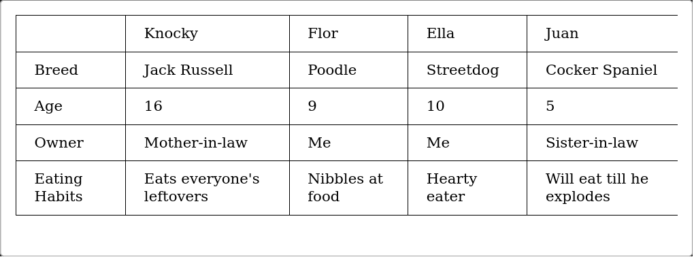

# INTERMEDIATE HTML AND CSS PERSONAL NOTES

## 1. Tables

- A table is a structured set of data made up of rows and columns (tabular data).
- It allows you to quickly and easily look up values that indicate some kind of connection between different types of data, i.e. a person and their age:

| **Person** | **Age** |
|------------|---------|
| Chris      | 38      |
| Dennis     | 45      |
| Sarah      | 29      |
| Karen      | 47      |

- **Table is rigid:** information is easily interpreted by making visual associations between row and column headers.

### 1.1. When NOT to use tables

- HTML tables should be used for **tabular data** — this is what they are designed for.
- A lot of people used to use HTML tables to lay out web pages, e.g. one row to contain the header, one row to contain the content columns, one row to contain the footer.
- This is a bad idea. The main reasons are as follows:
  - **Reduced accessibility for visually impaired users:** screen readers interpret the tags that exist in an HTML page and read out the contents to the user. Because tables are not the right tool for layout, the screen readers' output will be confusing to their users.
  - **Tables produce tag soup:** table layouts involve more complex markup structures than proper layout techniques. This can result in the code being harder to write, maintain, and debug.
  - **Tables are not responsive:** proper layout containers' (such as `<header>`, `<section>`, `<article>`, or `<div>`) width defaults to 100% of their parent element. Tables on the other hand are sized according to their content by default.

### 1.2. Creating first table

1. The content of every table is enclosed by these two tags: `<table></table>`. Add these inside the body of your HTML.
2. The smallest container inside a table is a table cell, which is created by a `<td>` element (`'td'` stands for **'table data'**). Add the following inside your table tags:

```html
<td>Hi, I'm your first cell.</td>
```

3. If we want a row of four cells, we need to copy these tags three times. Update the contents of your table to look like so (tip: you can use Emmet to create four `td` elements like this: `td*4`):

```html
<td>Hi, I'm your first cell.</td>
<td>I'm your second cell.</td>
<td>I'm your third cell.</td>
<td>I'm your fourth cell.</td>
```

The cells are not placed underneath each other, rather they are automatically aligned with each other on the same row. Each `<td>` element creates a single cell and together they make up the **first row**. Every cell we add makes the row grow longer.

4. To stop this row from growing and start placing subsequent cells on a second row, we need to use the `<tr>` element (`'tr'` stands for **'table row'**):

```html
<tr>
  <td>Hi, I'm your first cell.</td>
  <td>I'm your second cell.</td>
  <td>I'm your third cell.</td>
  <td>I'm your fourth cell.</td>
</tr>
```

5. Now you've made one row, have a go at making one more — each row needs to be wrapped in an additional `<tr>` element, with each cell contained in a `<td>`.

```html
<!DOCTYPE html>
<html lang="en">
<head>
  <meta charset="UTF-8">
  <meta http-equiv="X-UA-Compatible" content="IE=edge">
  <meta name="viewport" content="width=device-width, initial-scale=1.0">
  <title>First table template</title>
</head>
<body>
  <table>
    <tr>
      <td>Hi, I'm your first cell.</td>
      <td>I'm your second cell.</td>
      <td>I'm your third cell.</td>
      <td>I'm your fourth cell.</td>
    </tr>
    <tr>
      <td>One</td>
      <td>Two</td>
      <td>Three</td>
      <td>Four</td>
    </tr>
  </table>
</body>
</html>
```

### 1.3. Adding headers with `<th>` elements

- Now let's turn our attention to **table headers** — special cells that go at the start of a row or column and define the type of data that row or column contains.
- To illustrate why they are useful, have a look at the following table example. First the source code:

```html
<table>
  <tr>
    <td>&nbsp;</td>
    <td>Knocky</td>
    <td>Flor</td>
    <td>Ella</td>
    <td>Juan</td>
  </tr>
  <tr>
    <td>Breed</td>
    <td>Jack Russell</td>
    <td>Poodle</td>
    <td>Streetdog</td>
    <td>Cocker Spaniel</td>
  </tr>
  <tr>
    <td>Age</td>
    <td>16</td>
    <td>9</td>
    <td>10</td>
    <td>5</td>
  </tr>
  <tr>
    <td>Owner</td>
    <td>Mother-in-law</td>
    <td>Me</td>
    <td>Me</td>
    <td>Sister-in-law</td>
  </tr>
  <tr>
    <td>Eating Habits</td>
    <td>Eats everyone's leftovers</td>
    <td>Nibbles at food</td>
    <td>Hearty eater</td>
    <td>Will eat till he explodes</td>
  </tr>
</table>
```



- The problem here is that, while you can kind of make out what's going on, it is not as easy to cross reference data as it could be.
- If the column and row headings stood out in some way, it would be much better.
- To achieve that, we are going to use table headers

1. To recognize the table headers as headers, both visually and semantically, you can use the `<th>` element (`'th'` stands for **'table header'**). This works in exactly the same way as a `<td>`, except that it denotes a header, not a normal cell.
2. Go into your HTML, and change all the `<td>` elements surrounding the table headers into `<th>` elements.

```html
<table>
    <tr>
      <td>&nbsp;</td>
      <th>Knocky</th>
      <th>Flor</th>
      <th>Ella</th>
      <th>Juan</th>
    </tr>
    <tr>
      <th>Breed</th>
      <td>Jack Russell</td>
      <td>Poodle</td>
      <td>Streetdog</td>
      <td>Cocker Spaniel</td>
    </tr>
    <tr>
      <th>Age</th>
      <td>16</td>
      <td>9</td>
      <td>10</td>
      <td>5</td>
    </tr>
    <tr>
      <th>Owner</th>
      <td>Mother-in-law</td>
      <td>Me</td>
      <td>Me</td>
      <td>Sister-in-law</td>
    </tr>
    <tr>
      <th>Eating Habits</th>
      <td>Eats everyone's leftovers</td>
      <td>Nibbles at food</td>
      <td>Hearty eater</td>
      <td>Will eat till he explodes</td>
    </tr>
  </table>
```

- **Note:** Table headings come with some default styling — they are bold and centered even if you don't add your own styling to the table, to help them stand out.
- Along with the `scope` attribute, they allow you to make tables more accessible by associating each header with all the data in the same row or column.
- Screen readers are then able to read out a whole row or column of data at once, which is pretty useful.

### 1.4. Allowing cells to span multiple rows and columns

- Sometimes we want cells to span multiple rows or columns.
- Take the following simple example, which shows the names of common animals:
  - In some cases, we want to show the names of the males and females next to the animal name.
  - Sometimes we don't, and in such cases we just want the animal name to span the whole table.

The initial markup looks like this:

```html
<table>
  <tr>
    <th>Animals</th>
  </tr>
  <tr>
    <th>Hippopotamus</th>
  </tr>
  <tr>
    <th>Horse</th>
    <td>Mare</td>
  </tr>
  <tr>
    <td>Stallion</td>
  </tr>
  <tr>
    <th>Crocodile</th>
  </tr>
  <tr>
    <th>Chicken</th>
    <td>Hen</td>
  </tr>
  <tr>
    <td>Rooster</td>
  </tr>
</table>
```

- This is the output:


- We need a way to get "Animals", "Hippopotamus", and "Crocodile" to span across two columns, and "Horse" and "Chicken" to span downwards over two rows.
- Fortunately, table headers and cells have the `colspan` and `rowspan` attributes, which allow us to do just those things.
- Both accept a unitless number value, which equals the number of rows or columns you want spanned i.e., `colspan="2"` makes a cell span two columns.

1. Use `colspan` to make "Animals", "Hippopotamus", and "Crocodile" span across two columns.
2. Use `rowspan` to make "Horse" and "Chicken" span across two rows.
3. Save and open your code in a browser to see the improvement.

```html
  <table>
    <tr>
      <th colspan="2">Animals</th>
    </tr>
    <tr>
      <th colspan="2">Hippopotamus</th>
    </tr>
    <tr>
      <th rowspan="2">Horse</th>
      <td>Mare</td>
    </tr>
    <tr>
      <td>Stallion</td>
    </tr>
    <tr>
      <th colspan="2">Crocodile</th>
    </tr>
    <tr>
      <th rowspan="2">Chicken</th>
      <td>Hen</td>
    </tr>
    <tr>
      <td>Rooster</td>
    </tr>
  </table>
```
