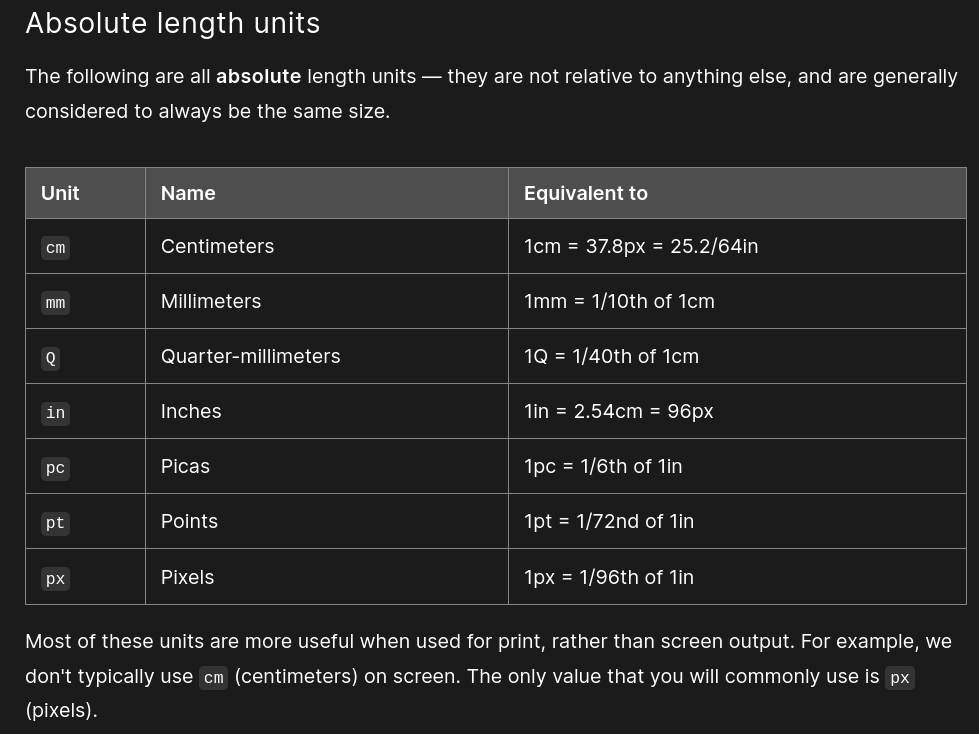

# INTERMEDIATE HTML AND CSS PERSONAL NOTES

## TABLE OF CONTENTS

- [INTERMEDIATE HTML AND CSS PERSONAL NOTES](#intermediate-html-and-css-personal-notes)
  - [TABLE OF CONTENTS](#table-of-contents)
  - [1. TABLES - BASIC STUFF](#1-tables---basic-stuff)
    - [1.1. When NOT to use tables](#11-when-not-to-use-tables)
    - [1.2. Creating first table](#12-creating-first-table)
    - [1.3. Adding headers with `<th>` elements](#13-adding-headers-with-th-elements)
    - [1.4. Allowing cells to span multiple rows and columns](#14-allowing-cells-to-span-multiple-rows-and-columns)
    - [1.5. Providing common styling to columns](#15-providing-common-styling-to-columns)
    - [1.6. Examples of Table Styling](#16-examples-of-table-styling)
  - [2. TABLES - ADVANCED FEATURES AND ACCESSIBILITY](#2-tables---advanced-features-and-accessibility)
    - [2.1. Adding a caption to your table with `<caption>`](#21-adding-a-caption-to-your-table-with-caption)
    - [2.2. Adding structure with `<thead>`, `<tfoot>`, and `<tbody>`](#22-adding-structure-with-thead-tfoot-and-tbody)
    - [2.3.Nesting tables](#23nesting-tables)
    - [2.4. Tables for visually impaired users](#24-tables-for-visually-impaired-users)
    - [2.5. Examples of scopes and headers](#25-examples-of-scopes-and-headers)
  - [3. CSS UNITS](#3-css-units)
    - [3.1. CSS values](#31-css-values)
    - [3.2. `em`, `rem` and percentage](#32-em-rem-and-percentage)
    - [3.3. Viewport Units](#33-viewport-units)
  - [4. MORE TEXT STYLES](#4-more-text-styles)
    - [4.1. Fonts](#41-fonts)
    - [4.2. Text Styles](#42-text-styles)
  - [5. MORE CSS PROPERTIES](#5-more-css-properties)
    - [5.1. Background](#51-background)
    - [5.2. Borders](#52-borders)
    - [5.3. Box Shadow](#53-box-shadow)
    - [5.4. Overflow](#54-overflow)
    - [5.5. Opacity](#55-opacity)
  - [6. ADVANCED SELECTORS](#6-advanced-selectors)
    - [6.1. Parent/Sibling Combinators](#61-parentsibling-combinators)
    - [6.2. Pseudo-selectors](#62-pseudo-selectors)
      - [6.2.1. Dynamic and User-Action Pseudo-Classes](#621-dynamic-and-user-action-pseudo-classes)
      - [6.2.2. Structural Pseudo-Classes](#622-structural-pseudo-classes)
      - [6.2.3. Pseudo-Elements](#623-pseudo-elements)
      - [6.2.4. Attribute Selectors](#624-attribute-selectors)
  - [7.POSITIONING](#7positioning)
    - [7.1. Static and Relative Positioning](#71-static-and-relative-positioning)
    - [7.2. Absolute Positioning](#72-absolute-positioning)
    - [7.3. Fixed Positioning](#73-fixed-positioning)
    - [7.4. Sticky Positioning](#74-sticky-positioning)
  - [8. FUNCTIONS](#8-functions)
    - [8.1. `calc()` Function](#81-calc-function)
    - [8.2. `min()`function](#82-minfunction)
    - [8.3. `max()` function](#83-max-function)
    - [8.4. `clamp()` function](#84-clamp-function)
  - [9. CUSTOM PROPERTIES (OR CSS VARIABLES)](#9-custom-properties-or-css-variables)
    - [9.1. Fallback values](#91-fallback-values)
    - [9.2. Scope](#92-scope)
    - [9.3. The `:root` selector](#93-the-root-selector)
    - [9.4. Inheritance](#94-inheritance)
    - [9.5. Themes with custom properties](#95-themes-with-custom-properties)
    - [9.6. Media Queries](#96-media-queries)
  - [10. FRAMEWORKS AND PREPROCESSORS](#10-frameworks-and-preprocessors)
    - [10.1. Frameworks](#101-frameworks)
    - [10.2. Disadvantages of Frameworks](#102-disadvantages-of-frameworks)
    - [10.3. Preprocessors](#103-preprocessors)
  - [11. FORM BASICS](#11-form-basics)
    - [11.1. Introduction](#111-introduction)
    - [11.2. The Form Element](#112-the-form-element)
    - [11.3. Form Controls](#113-form-controls)
      - [11.3.1. Input Element](#1131-input-element)
      - [11.3.2. Labels](#1132-labels)
      - [11.3.3. Placeholder Attribute](#1133-placeholder-attribute)
      - [11.3.4. The Name Attribute](#1134-the-name-attribute)
      - [11.3.5. Using Form Controls Outside of a Form](#1135-using-form-controls-outside-of-a-form)
      - [11.3.6. The Type Attribute](#1136-the-type-attribute)
      - [11.3.7. Selection Elements](#1137-selection-elements)
      - [11.3.8. Buttons](#1138-buttons)
    - [11.4. Organizing Form Elements](#114-organizing-form-elements)
      - [11.4.1. Fieldset](#1141-fieldset)
      - [11.4.2. Legend](#1142-legend)
    - [11.5. Note on Styling Forms](#115-note-on-styling-forms)

## 1. TABLES - BASIC STUFF

- A table is a structured set of data made up of rows and columns (tabular data).
- It allows you to quickly and easily look up values that indicate some kind of connection between different types of data, i.e. a person and their age:

| **Person** | **Age** |
|------------|---------|
| Chris      | 38      |
| Dennis     | 45      |
| Sarah      | 29      |
| Karen      | 47      |

- **Table is rigid:** information is easily interpreted by making visual associations between row and column headers.

<div style="text-align: right">

[BACK TO TOP](#table-of-contents)

</div>

### 1.1. When NOT to use tables

- HTML tables should be used for **tabular data** — this is what they are designed for.
- A lot of people used to use HTML tables to lay out web pages, e.g. one row to contain the header, one row to contain the content columns, one row to contain the footer.
- This is a bad idea. The main reasons are as follows:
  - **Reduced accessibility for visually impaired users:** screen readers interpret the tags that exist in an HTML page and read out the contents to the user. Because tables are not the right tool for layout, the screen readers' output will be confusing to their users.
  - **Tables produce tag soup:** table layouts involve more complex markup structures than proper layout techniques. This can result in the code being harder to write, maintain, and debug.
  - **Tables are not responsive:** proper layout containers' (such as `<header>`, `<section>`, `<article>`, or `<div>`) width defaults to 100% of their parent element. Tables on the other hand are sized according to their content by default.

<div style="text-align: right">

[BACK TO TOP](#table-of-contents)

</div>

### 1.2. Creating first table

1. The content of every table is enclosed by these two tags: `<table></table>`. Add these inside the body of your HTML.
2. The smallest container inside a table is a table cell, which is created by a `<td>` element (`'td'` stands for **'table data'**). Add the following inside your table tags:

```html
<td>Hi, I'm your first cell.</td>
```

3. If we want a row of four cells, we need to copy these tags three times. Update the contents of your table to look like so (tip: you can use Emmet to create four `td` elements like this: `td*4`):

```html
<td>Hi, I'm your first cell.</td>
<td>I'm your second cell.</td>
<td>I'm your third cell.</td>
<td>I'm your fourth cell.</td>
```

The cells are not placed underneath each other, rather they are automatically aligned with each other on the same row. Each `<td>` element creates a single cell and together they make up the **first row**. Every cell we add makes the row grow longer.

4. To stop this row from growing and start placing subsequent cells on a second row, we need to use the `<tr>` element (`'tr'` stands for **'table row'**):

```html
<tr>
  <td>Hi, I'm your first cell.</td>
  <td>I'm your second cell.</td>
  <td>I'm your third cell.</td>
  <td>I'm your fourth cell.</td>
</tr>
```

5. Now you've made one row, have a go at making one more — each row needs to be wrapped in an additional `<tr>` element, with each cell contained in a `<td>`.

```html
<!DOCTYPE html>
<html lang="en">
<head>
  <meta charset="UTF-8">
  <meta http-equiv="X-UA-Compatible" content="IE=edge">
  <meta name="viewport" content="width=device-width, initial-scale=1.0">
  <title>First table template</title>
</head>
<body>
  <table>
    <tr>
      <td>Hi, I'm your first cell.</td>
      <td>I'm your second cell.</td>
      <td>I'm your third cell.</td>
      <td>I'm your fourth cell.</td>
    </tr>
    <tr>
      <td>One</td>
      <td>Two</td>
      <td>Three</td>
      <td>Four</td>
    </tr>
  </table>
</body>
</html>
```

<div style="text-align: right">

[BACK TO TOP](#table-of-contents)

</div>

### 1.3. Adding headers with `<th>` elements

- Now let's turn our attention to **table headers** — special cells that go at the start of a row or column and define the type of data that row or column contains.
- To illustrate why they are useful, have a look at the following table example. First the source code:

```html
<table>
  <tr>
    <td>&nbsp;</td>
    <td>Knocky</td>
    <td>Flor</td>
    <td>Ella</td>
    <td>Juan</td>
  </tr>
  <tr>
    <td>Breed</td>
    <td>Jack Russell</td>
    <td>Poodle</td>
    <td>Streetdog</td>
    <td>Cocker Spaniel</td>
  </tr>
  <tr>
    <td>Age</td>
    <td>16</td>
    <td>9</td>
    <td>10</td>
    <td>5</td>
  </tr>
  <tr>
    <td>Owner</td>
    <td>Mother-in-law</td>
    <td>Me</td>
    <td>Me</td>
    <td>Sister-in-law</td>
  </tr>
  <tr>
    <td>Eating Habits</td>
    <td>Eats everyone's leftovers</td>
    <td>Nibbles at food</td>
    <td>Hearty eater</td>
    <td>Will eat till he explodes</td>
  </tr>
</table>
```

<table>
  <tr>
    <td>&nbsp;</td>
    <td>Knocky</td>
    <td>Flor</td>
    <td>Ella</td>
    <td>Juan</td>
  </tr>
  <tr>
    <td>Breed</td>
    <td>Jack Russell</td>
    <td>Poodle</td>
    <td>Streetdog</td>
    <td>Cocker Spaniel</td>
  </tr>
  <tr>
    <td>Age</td>
    <td>16</td>
    <td>9</td>
    <td>10</td>
    <td>5</td>
  </tr>
  <tr>
    <td>Owner</td>
    <td>Mother-in-law</td>
    <td>Me</td>
    <td>Me</td>
    <td>Sister-in-law</td>
  </tr>
  <tr>
    <td>Eating Habits</td>
    <td>Eats everyone's leftovers</td>
    <td>Nibbles at food</td>
    <td>Hearty eater</td>
    <td>Will eat till he explodes</td>
  </tr>
</table>

- The problem here is that, while you can kind of make out what's going on, it is not as easy to cross reference data as it could be.
- If the column and row headings stood out in some way, it would be much better.
- To achieve that, we are going to use table headers

1. To recognize the table headers as headers, both visually and semantically, you can use the `<th>` element (`'th'` stands for **'table header'**). This works in exactly the same way as a `<td>`, except that it denotes a header, not a normal cell.
2. Go into your HTML, and change all the `<td>` elements surrounding the table headers into `<th>` elements.

```html
<table>
    <tr>
      <td>&nbsp;</td>
      <th>Knocky</th>
      <th>Flor</th>
      <th>Ella</th>
      <th>Juan</th>
    </tr>
    <tr>
      <th>Breed</th>
      <td>Jack Russell</td>
      <td>Poodle</td>
      <td>Streetdog</td>
      <td>Cocker Spaniel</td>
    </tr>
    <tr>
      <th>Age</th>
      <td>16</td>
      <td>9</td>
      <td>10</td>
      <td>5</td>
    </tr>
    <tr>
      <th>Owner</th>
      <td>Mother-in-law</td>
      <td>Me</td>
      <td>Me</td>
      <td>Sister-in-law</td>
    </tr>
    <tr>
      <th>Eating Habits</th>
      <td>Eats everyone's leftovers</td>
      <td>Nibbles at food</td>
      <td>Hearty eater</td>
      <td>Will eat till he explodes</td>
    </tr>
  </table>
```

<table>
    <tr>
      <td>&nbsp;</td>
      <th>Knocky</th>
      <th>Flor</th>
      <th>Ella</th>
      <th>Juan</th>
    </tr>
    <tr>
      <th>Breed</th>
      <td>Jack Russell</td>
      <td>Poodle</td>
      <td>Streetdog</td>
      <td>Cocker Spaniel</td>
    </tr>
    <tr>
      <th>Age</th>
      <td>16</td>
      <td>9</td>
      <td>10</td>
      <td>5</td>
    </tr>
    <tr>
      <th>Owner</th>
      <td>Mother-in-law</td>
      <td>Me</td>
      <td>Me</td>
      <td>Sister-in-law</td>
    </tr>
    <tr>
      <th>Eating Habits</th>
      <td>Eats everyone's leftovers</td>
      <td>Nibbles at food</td>
      <td>Hearty eater</td>
      <td>Will eat till he explodes</td>
    </tr>
  </table>

- **Note:** Table headings come with some default styling — they are bold and centered even if you don't add your own styling to the table, to help them stand out.
- Along with the `scope` attribute, they allow you to make tables more accessible by associating each header with all the data in the same row or column.
- Screen readers are then able to read out a whole row or column of data at once, which is pretty useful.

<div style="text-align: right">

[BACK TO TOP](#table-of-contents)

</div>

### 1.4. Allowing cells to span multiple rows and columns

- Sometimes we want cells to span multiple rows or columns.
- Take the following simple example, which shows the names of common animals:
  - In some cases, we want to show the names of the males and females next to the animal name.
  - Sometimes we don't, and in such cases we just want the animal name to span the whole table.

The initial markup looks like this:

```html
<table>
  <tr>
    <th>Animals</th>
  </tr>
  <tr>
    <th>Hippopotamus</th>
  </tr>
  <tr>
    <th>Horse</th>
    <td>Mare</td>
  </tr>
  <tr>
    <td>Stallion</td>
  </tr>
  <tr>
    <th>Crocodile</th>
  </tr>
  <tr>
    <th>Chicken</th>
    <td>Hen</td>
  </tr>
  <tr>
    <td>Rooster</td>
  </tr>
</table>
```

- This is the output:

<table>
  <tr>
    <th>Animals</th>
  </tr>
  <tr>
    <th>Hippopotamus</th>
  </tr>
  <tr>
    <th>Horse</th>
    <td>Mare</td>
  </tr>
  <tr>
    <td>Stallion</td>
  </tr>
  <tr>
    <th>Crocodile</th>
  </tr>
  <tr>
    <th>Chicken</th>
    <td>Hen</td>
  </tr>
  <tr>
    <td>Rooster</td>
  </tr>
</table>

- We need a way to get "Animals", "Hippopotamus", and "Crocodile" to span across two columns, and "Horse" and "Chicken" to span downwards over two rows.
- Fortunately, table headers and cells have the `colspan` and `rowspan` attributes, which allow us to do just those things.
- Both accept a unitless number value, which equals the number of rows or columns you want spanned i.e., `colspan="2"` makes a cell span two columns.

1. Use `colspan` to make "Animals", "Hippopotamus", and "Crocodile" span across two columns.
2. Use `rowspan` to make "Horse" and "Chicken" span across two rows.
3. Save and open your code in a browser to see the improvement.

```html
  <table>
    <tr>
      <th colspan="2">Animals</th>
    </tr>
    <tr>
      <th colspan="2">Hippopotamus</th>
    </tr>
    <tr>
      <th rowspan="2">Horse</th>
      <td>Mare</td>
    </tr>
    <tr>
      <td>Stallion</td>
    </tr>
    <tr>
      <th colspan="2">Crocodile</th>
    </tr>
    <tr>
      <th rowspan="2">Chicken</th>
      <td>Hen</td>
    </tr>
    <tr>
      <td>Rooster</td>
    </tr>
  </table>
```

<table>
  <tr>
    <th colspan="2">Animals</th>
  </tr>
  <tr>
    <th colspan="2">Hippopotamus</th>
  </tr>
  <tr>
    <th rowspan="2">Horse</th>
    <td>Mare</td>
  </tr>
  <tr>
    <td>Stallion</td>
  </tr>
  <tr>
    <th colspan="2">Crocodile</th>
  </tr>
  <tr>
    <th rowspan="2">Chicken</th>
    <td>Hen</td>
  </tr>
  <tr>
    <td>Rooster</td>
  </tr>
</table>

<div style="text-align: right">

[BACK TO TOP](#table-of-contents)

</div>

### 1.5. Providing common styling to columns

- HTML has a method of defining styling information for an entire column of data all in one place — the `<col>` and `<colgroup>` elements.
- These exist because normally you'd have to specify your styling information on every `<td>` or `<th>` in the column, or use a complex selector such as `:nth-child`.
- **Note:** Styling columns like this is limited to a few properties: `border`, `background`, `width`, and `visibility`. To set other properties you'll have to either style every `<td>` or `<th>` in the column, or use a complex selector such as `:nth-child`.
- Take the following simple example:

```html
<table>
  <tr>
    <th>Data 1</th>
    <th style="background-color: yellow">Data 2</th>
  </tr>
  <tr>
    <td>Calcutta</td>
    <td style="background-color: yellow">Orange</td>
  </tr>
  <tr>
    <td>Robots</td>
    <td style="background-color: yellow">Jazz</td>
  </tr>
</table>
```

Which gives us

<table>
  <tr>
    <th>Data 1</th>
    <th style="background-color: yellow">Data 2</th>
  </tr>
  <tr>
    <td>Calcutta</td>
    <td style="background-color: yellow">Orange</td>
  </tr>
  <tr>
    <td>Robots</td>
    <td style="background-color: yellow">Jazz</td>
  </tr>
</table>

- This isn't ideal, as we have to repeat the styling information across all three cells in the column (we'd probably have a class set on all three in a real project and specify the styling in a separate stylesheet).
- Instead of doing this, we can specify the information once, on a `<col>` element.
- `<col>` elements are specified inside a `<colgroup>` container just below the opening `<table>` tag. We could create the same effect as we see above by specifying our table as follows:

```html
<table>
  <colgroup>
    <col />
    <col style="background-color: yellow" />
  </colgroup>
  <tr>
    <th>Data 1</th>
    <th>Data 2</th>
  </tr>
  <tr>
    <td>Calcutta</td>
    <td>Orange</td>
  </tr>
  <tr>
    <td>Robots</td>
    <td>Jazz</td>
  </tr>
</table>
```

<table>
  <colgroup>
    <col />
    <col style="background-color: yellow" />
  </colgroup>
  <tr>
    <th>Data 1</th>
    <th>Data 2</th>
  </tr>
  <tr>
    <td>Calcutta</td>
    <td>Orange</td>
  </tr>
  <tr>
    <td>Robots</td>
    <td>Jazz</td>
  </tr>
</table>

- Effectively we are defining two "style columns", one specifying styling information for each column.
- We still have to include a blank `<col>` element — if we didn't, the styling would just be applied to the first column.
- If we wanted to apply the styling information to both columns, we could just include one `<col>` element with a span attribute on it, like this:

```html
<colgroup>
  <col style="background-color: yellow" span="2" />
</colgroup>
```

<table>
  <colgroup>
    <col style="background-color: yellow" span="2" />
  </colgroup>
  <tr>
    <th>Data 1</th>
    <th>Data 2</th>
  </tr>
  <tr>
    <td>Calcutta</td>
    <td>Orange</td>
  </tr>
  <tr>
    <td>Robots</td>
    <td>Jazz</td>
  </tr>
</table>

- Just like `colspan` and `rowspan`, `span` takes a unitless number value that specifies the number of columns you want the styling to apply to.

<div style="text-align: right">

[BACK TO TOP](#table-of-contents)

</div>

### 1.6. Examples of Table Styling

- Below you can see the timetable of a languages teacher. On Friday she has a new class teaching Dutch all day, but she also teaches German for a few periods on Tuesday and Thursdays. She wants to highlight the columns containing the days she is teaching.

```html
<!DOCTYPE html>
<html lang="en-us">
  <head>
    <meta charset="utf-8">
    <meta name="viewport" content="width=device-width">
    <title>School timetable</title>
    <style>
    html {
      font-family: sans-serif;
    }

    table {
      border-collapse: collapse;
      border: 2px solid rgb(200,200,200);
      letter-spacing: 1px;
      font-size: 0.8rem;
    }

    td, th {
      border: 1px solid rgb(190,190,190);
      padding: 10px 20px;
    }

    td {
      text-align: center;
    }

    caption {
      padding: 10px;
    }
    </style>
  </head>
  <body>
    <h1>School timetable</h1>

    <table>
      <tr>
        <td>&nbsp;</td>
        <th>Mon</th>
        <th>Tues</th>
        <th>Wed</th>
        <th>Thurs</th>
        <th>Fri</th>
        <th>Sat</th>
        <th>Sun</th>
      </tr>
      <tr>
        <th>1st period</th>
        <td>English</td>
        <td>&nbsp;</td>
        <td>&nbsp;</td>
        <td>German</td>
        <td>Dutch</td>
        <td>&nbsp;</td>
        <td>&nbsp;</td>
      </tr>
      <tr>
        <th>2nd period</th>
        <td>English</td>
        <td>English</td>
        <td>&nbsp;</td>
        <td>German</td>
        <td>Dutch</td>
        <td>&nbsp;</td>
        <td>&nbsp;</td>
      </tr>
      <tr>
        <th>3rd period</th>
        <td>&nbsp;</td>
        <td>German</td>
        <td>&nbsp;</td>
        <td>German</td>
        <td>Dutch</td>
        <td>&nbsp;</td>
        <td>&nbsp;</td>
      </tr>
      <tr>
        <th>4th period</th>
        <td>&nbsp;</td>
        <td>English</td>
        <td>&nbsp;</td>
        <td>English</td>
        <td>Dutch</td>
        <td>&nbsp;</td>
        <td>&nbsp;</td>
      </tr>
    </table>


  </body>
</html>
```

<body>
  <h2>School timetable</h1>

  <table>
    <tr>
      <td>&nbsp;</td>
      <th>Mon</th>
      <th>Tues</th>
      <th>Wed</th>
      <th>Thurs</th>
      <th>Fri</th>
      <th>Sat</th>
      <th>Sun</th>
    </tr>
    <tr>
      <th>1st period</th>
      <td>English</td>
      <td>&nbsp;</td>
      <td>&nbsp;</td>
      <td>German</td>
      <td>Dutch</td>
      <td>&nbsp;</td>
      <td>&nbsp;</td>
    </tr>
    <tr>
      <th>2nd period</th>
      <td>English</td>
      <td>English</td>
      <td>&nbsp;</td>
      <td>German</td>
      <td>Dutch</td>
      <td>&nbsp;</td>
      <td>&nbsp;</td>
    </tr>
    <tr>
      <th>3rd period</th>
      <td>&nbsp;</td>
      <td>German</td>
      <td>&nbsp;</td>
      <td>German</td>
      <td>Dutch</td>
      <td>&nbsp;</td>
      <td>&nbsp;</td>
    </tr>
    <tr>
      <th>4th period</th>
      <td>&nbsp;</td>
      <td>English</td>
      <td>&nbsp;</td>
      <td>English</td>
      <td>Dutch</td>
      <td>&nbsp;</td>
      <td>&nbsp;</td>
    </tr>
  </table>
</body>
<br>

- Add a `<colgroup>` element at the top of the table, just underneath the `<table>` tag, in which you can add your `<col>` elements (see the remaining steps below).
- The first two columns need to be left unstyled.
- Add a background color to the third column. The value for your style attribute is `background-color:#97DB9A`;
- Set a separate `width` on the fourth column. The value for your style attribute is `width: 42px`;
Add a background color to the fifth column. The value for your style attribute is `background-color: #97DB9A`;
Add a different background color plus a border to the sixth column, to signify that this is a special day and she's teaching a new class. The values for your style attribute are `background-color:#DCC48E; border:4px solid #C1437A`;
The last two days are free days, so just set them to no background color but a set `width`; the value for the style attribute is `width: 42px`;

```html
body>
  <h2>School timetable</h1>

  <table>
    <colgroup>
      <col />
      <col />
      <col style="background-color: #97DB9A"/>
      <col style="width: 42px"/>
      <col style="background-color: #97DB9A" />
      <col style="background-color:#DCC48E; border:4px solid #C1437A"/>
      <col style="width: 42px" span="2"/>
    </colgroup>
    <tr>
      <td>&nbsp;</td>
      <th>Mon</th>
      <th>Tues</th>
      <th>Wed</th>
      <th>Thurs</th>
      <th>Fri</th>
      <th>Sat</th>
      <th>Sun</th>
    </tr>
    <tr>
      <th>1st period</th>
      <td>English</td>
      <td>&nbsp;</td>
      <td>&nbsp;</td>
      <td>German</td>
      <td>Dutch</td>
      <td>&nbsp;</td>
      <td>&nbsp;</td>
    </tr>
    <tr>
      <th>2nd period</th>
      <td>English</td>
      <td>English</td>
      <td>&nbsp;</td>
      <td>German</td>
      <td>Dutch</td>
      <td>&nbsp;</td>
      <td>&nbsp;</td>
    </tr>
    <tr>
      <th>3rd period</th>
      <td>&nbsp;</td>
      <td>German</td>
      <td>&nbsp;</td>
      <td>German</td>
      <td>Dutch</td>
      <td>&nbsp;</td>
      <td>&nbsp;</td>
    </tr>
    <tr>
      <th>4th period</th>
      <td>&nbsp;</td>
      <td>English</td>
      <td>&nbsp;</td>
      <td>English</td>
      <td>Dutch</td>
      <td>&nbsp;</td>
      <td>&nbsp;</td>
    </tr>
  </table>
</body>
```

<body>
  <h2>School timetable</h1>

  <table>
    <colgroup>
      <col />
      <col />
      <col style="background-color: #97DB9A"/>
      <col style="width: 42px"/>
      <col style="background-color: #97DB9A" />
      <col style="background-color:#DCC48E; border:4px solid #C1437A"/>
      <col style="width: 42px" span="2"/>
    </colgroup>
    <tr>
      <td>&nbsp;</td>
      <th>Mon</th>
      <th>Tues</th>
      <th>Wed</th>
      <th>Thurs</th>
      <th>Fri</th>
      <th>Sat</th>
      <th>Sun</th>
    </tr>
    <tr>
      <th>1st period</th>
      <td>English</td>
      <td>&nbsp;</td>
      <td>&nbsp;</td>
      <td>German</td>
      <td>Dutch</td>
      <td>&nbsp;</td>
      <td>&nbsp;</td>
    </tr>
    <tr>
      <th>2nd period</th>
      <td>English</td>
      <td>English</td>
      <td>&nbsp;</td>
      <td>German</td>
      <td>Dutch</td>
      <td>&nbsp;</td>
      <td>&nbsp;</td>
    </tr>
    <tr>
      <th>3rd period</th>
      <td>&nbsp;</td>
      <td>German</td>
      <td>&nbsp;</td>
      <td>German</td>
      <td>Dutch</td>
      <td>&nbsp;</td>
      <td>&nbsp;</td>
    </tr>
    <tr>
      <th>4th period</th>
      <td>&nbsp;</td>
      <td>English</td>
      <td>&nbsp;</td>
      <td>English</td>
      <td>Dutch</td>
      <td>&nbsp;</td>
      <td>&nbsp;</td>
    </tr>
  </table>
</body>

<div style="text-align: right">

[BACK TO TOP](#table-of-contents)

</div>

---

## 2. TABLES - ADVANCED FEATURES AND ACCESSIBILITY

### 2.1. Adding a caption to your table with `<caption>`

- You can give your table a caption by putting it inside a `<caption>` element and nesting that inside the `<table>` element. You should put it just below the opening `<table>` tag.

```html
<table>
  <caption>
    Dinosaurs in the Jurassic period
  </caption>

  …
</table>
```

- As you can infer from the brief example above, the caption is meant to contain a description of the table contents.
- This is useful for all readers wishing to get a quick idea of whether the table is useful to them as they scan the page, but particularly for blind users.
- Rather than have a screen reader read out the contents of many cells just to find out what the table is about, the user can rely on a caption and then decide whether or not to read the table in greater detail.
- A caption is placed directly beneath the `<table>` tag.
- **Note:** The summary attribute can also be used on the `<table>` element to provide a description — this is also read out by screen readers. We'd recommend using the `<caption>` element instead, however, as summary is deprecated and can't be read by sighted users (it doesn't appear on the page).

<body>
  <h2>School timetable</h1>

  <table>
    <caption> Language Teacher's Timetable
    <colgroup>
      <col />
      <col />
      <col style="background-color: #97DB9A"/>
      <col style="width: 42px"/>
      <col style="background-color: #97DB9A" />
      <col style="background-color:#DCC48E; border:4px solid #C1437A"/>
      <col style="width: 42px" span="2"/>
    </colgroup>
    <tr>
      <td>&nbsp;</td>
      <th>Mon</th>
      <th>Tues</th>
      <th>Wed</th>
      <th>Thurs</th>
      <th>Fri</th>
      <th>Sat</th>
      <th>Sun</th>
    </tr>
    <tr>
      <th>1st period</th>
      <td>English</td>
      <td>&nbsp;</td>
      <td>&nbsp;</td>
      <td>German</td>
      <td>Dutch</td>
      <td>&nbsp;</td>
      <td>&nbsp;</td>
    </tr>
    <tr>
      <th>2nd period</th>
      <td>English</td>
      <td>English</td>
      <td>&nbsp;</td>
      <td>German</td>
      <td>Dutch</td>
      <td>&nbsp;</td>
      <td>&nbsp;</td>
    </tr>
    <tr>
      <th>3rd period</th>
      <td>&nbsp;</td>
      <td>German</td>
      <td>&nbsp;</td>
      <td>German</td>
      <td>Dutch</td>
      <td>&nbsp;</td>
      <td>&nbsp;</td>
    </tr>
    <tr>
      <th>4th period</th>
      <td>&nbsp;</td>
      <td>English</td>
      <td>&nbsp;</td>
      <td>English</td>
      <td>Dutch</td>
      <td>&nbsp;</td>
      <td>&nbsp;</td>
    </tr>
  </table>
</body>
<br>

<div style="text-align: right">

[BACK TO TOP](#table-of-contents)

</div>

### 2.2. Adding structure with `<thead>`, `<tfoot>`, and `<tbody>`

- As your tables get a bit more complex in structure, it is useful to give them more structural definition.
- One clear way to do this is by using `<thead>`, `<tfoot>`, and `<tbody>`, which allow you to mark up a header, footer, and body section for the table.
- These elements don't make the table any more accessible to screen reader users, and don't result in any visual enhancement on their own.
- They are however very useful for styling and layout — acting as useful hooks for adding CSS to your table.
- To give you some interesting examples, in the case of a long table you could make the table header and footer repeat on every printed page, and you could make the table body display on a single page and have the contents available by scrolling up and down.
- To use them:
  - The `<thead>` element must wrap the part of the table that is the header — this is usually the first row containing the column headings, but this is not necessarily always the case. If you are using `<col>`/`<colgroup>` element, the table header should come just below those.
  - The `<tfoot>` element needs to wrap the part of the table that is the footer — this might be a final row with items in the previous rows summed, for example. You can include the table footer right at the bottom of the table as you'd expect, or just below the table header (the browser will still render it at the bottom of the table).
  - The `<tbody>` element needs to wrap the other parts of the table content that aren't in the table header or footer. It will appear below the table header or sometimes footer, depending on how you decided to structure it.

- **Note:** `<tbody>` is always included in every table, implicitly if you don't specify it in your code. To check this, open up one of your previous examples that doesn't include `<tbody>` and look at the HTML code in your browser developer tools — you will see that the browser has added this tag for you. You might wonder why you ought to bother including it at all — you should, because it gives you more control over your table structure and styling.

**Example:**

```html
<!DOCTYPE html>
<html lang="en-us">
  <head>
    <meta charset="utf-8">
    <meta name="viewport" content="width=device-width">
    <title>My spending record</title>
    <link href="minimal-table.css" rel="stylesheet" type="text/css">
    <style>
    </style>
  </head>
  <body>
    <h1>My spending record</h1>

      <table>
        <caption>How I chose to spend my money</caption>
          <tr>
            <th>Purchase</th>
            <th>Location</th>
            <th>Date</th>
            <th>Evaluation</th>
            <th>Cost (€)</th>
          </tr>
          <tr>
            <td>SUM</td>
            <td>118</td>
          </tr>
          <tr>
            <td>Haircut</td>
            <td>Hairdresser</td>
            <td>12/09</td>
            <td>Great idea</td>
            <td>30</td>
          </tr>
          <tr>
            <td>Lasagna</td>
            <td>Restaurant</td>
            <td>12/09</td>
            <td>Regrets</td>
            <td>18</td>
          </tr>
          <tr>
            <td>Shoes</td>
            <td>Shoeshop</td>
            <td>13/09</td>
            <td>Big regrets</td>
            <td>65</td>
          </tr>
          <tr>
            <td>Toothpaste</td>
            <td>Supermarket</td>
            <td>13/09</td>
            <td>Good</td>
            <td>5</td>
          </tr>
    </table>

  </body>
</html>
```

<table>
  <caption>How I chose to spend my money</caption>
    <tr>
      <th>Purchase</th>
      <th>Location</th>
      <th>Date</th>
      <th>Evaluation</th>
      <th>Cost (€)</th>
    </tr>
    <tr>
      <td>SUM</td>
      <td>118</td>
    </tr>
    <tr>
      <td>Haircut</td>
      <td>Hairdresser</td>
      <td>12/09</td>
      <td>Great idea</td>
      <td>30</td>
    </tr>
    <tr>
      <td>Lasagna</td>
      <td>Restaurant</td>
      <td>12/09</td>
      <td>Regrets</td>
      <td>18</td>
    </tr>
    <tr>
      <td>Shoes</td>
      <td>Shoeshop</td>
      <td>13/09</td>
      <td>Big regrets</td>
      <td>65</td>
    </tr>
    <tr>
      <td>Toothpaste</td>
      <td>Supermarket</td>
      <td>13/09</td>
      <td>Good</td>
      <td>5</td>
    </tr>
</table>

- It looks OK, but it could stand to be improved.
- The "SUM" row that contains a summation of the spent amounts seems to be in the wrong place, and there are some details missing from the code.
- Put the obvious headers row inside a `<thead>` element, the "SUM" row inside a `<tfoot>` element, and the rest of the content inside a `<tbody>` element.
- You'll see that adding the `<tfoot>` element has caused the "SUM" row to go down to the bottom of the table.
- Next, add a `colspan` attribute to make the "SUM" cell span across the first four columns, so the actual number appears at the bottom of the "Cost" column.
- Let's add some simple extra styling to the table, to give you an idea of how useful these elements are for applying CSS. Inside the head of your HTML document, you'll see an empty `<style>` element. Inside this element, add the following lines of CSS code:

```css
tbody {
  font-size: 95%;
  font-style: italic;
}

tfoot {
  font-weight: bold;
}
```

- Have a look at the result. If the `<tbody>` and `<tfoot>` elements weren't in place, you'd have to write much more complicated selectors/rules to apply the same styling.

<table>
  <caption>How I chose to spend my money</caption>
    <thead>
      <tr>
        <th>Purchase</th>
        <th>Location</th>
        <th>Date</th>
        <th>Evaluation</th>
        <th>Cost (€)</th>
      </tr>
    </thead>
    <tfoot style="font-weight: bold"/>
      <tr>
        <td colspan="4">SUM</td>
        <td>118</td>
      </tr>
    </tfoot>
    <tbody style="font-size: 95%; font-style: italic"/>
      <tr>
        <td>Haircut</td>
        <td>Hairdresser</td>
        <td>12/09</td>
        <td>Great idea</td>
        <td>30</td>
      </tr>
      <tr>
        <td>Lasagna</td>
        <td>Restaurant</td>
        <td>12/09</td>
        <td>Regrets</td>
        <td>18</td>
      </tr>
      <tr>
        <td>Shoes</td>
        <td>Shoeshop</td>
        <td>13/09</td>
        <td>Big regrets</td>
        <td>65</td>
      </tr>
      <tr>
        <td>Toothpaste</td>
        <td>Supermarket</td>
        <td>13/09</td>
        <td>Good</td>
        <td>5</td>
      </tr>
    </tbody>
</table>

<div style="text-align: right">

[BACK TO TOP](#table-of-contents)

</div>

### 2.3.Nesting tables

- It is possible to nest a table inside another one, as long as you include the complete structure, including the `<table>` element.
- This is generally not really advised, as it makes the markup more confusing and less accessible to screen reader users, and in many cases you might as well just insert extra cells/rows/columns into the existing table.
- It is however sometimes necessary, for example if you want to import content easily from other sources.
- The following markup shows a simple nested table:

```html
<table id="table1">
  <tr>
    <th>title1</th>
    <th>title2</th>
    <th>title3</th>
  </tr>
  <tr>
    <td id="nested">
      <table id="table2">
        <tr>
          <td>cell1</td>
          <td>cell2</td>
          <td>cell3</td>
        </tr>
      </table>
    </td>
    <td>cell2</td>
    <td>cell3</td>
  </tr>
  <tr>
    <td>cell4</td>
    <td>cell5</td>
    <td>cell6</td>
  </tr>
</table>
```

<table id="table1">
  <tr>
    <th>title1</th>
    <th>title2</th>
    <th>title3</th>
  </tr>
  <tr>
    <td id="nested">
      <table id="table2">
        <tr>
          <td>cell1</td>
          <td>cell2</td>
          <td>cell3</td>
        </tr>
      </table>
    </td>
    <td>cell2</td>
    <td>cell3</td>
  </tr>
  <tr>
    <td>cell4</td>
    <td>cell5</td>
    <td>cell6</td>
  </tr>
</table>

<div style="text-align: right">

[BACK TO TOP](#table-of-contents)

</div>

### 2.4. Tables for visually impaired users

- A table can be a handy tool, for giving us quick access to data and allowing us to look up different values.
- For example, it takes only a short glance at the table below to find out how many rings were sold in Gent during August 2016.


- To understand its information we make visual associations between the data in this table and its column and/or row headers.
- But what if you cannot make those visual associations? How then can you read a table like the above? Visually impaired people often use a screen reader that reads out information on web pages to them.
- This is no problem when you're reading plain text but interpreting a table can be quite a challenge for a blind person. Nevertheless, with the proper markup we can replace visual associations by programmatic ones.
- **Note:** There are around 253 Million people living with Visual Impairment according to WHO data in 2017.
- Screen readers will identify all headers and use them to make programmatic associations between those headers and the cells they relate to.
- The combination of column and row headers will identify and interpret the data in each cell so that screen reader users can interpret the table similarly to how a sighted user does.
- The scope attribute can be added to the `<th>` element to tell screen readers exactly what cells the header is a header for — is it a header for the row it is in, or the column, for example? Looking back to our spending record example from earlier on, you could unambiguously define the column headers as column headers like this:

```html
<thead>
  <tr>
    <th scope="col">Purchase</th>
    <th scope="col">Location</th>
    <th scope="col">Date</th>
    <th scope="col">Evaluation</th>
    <th scope="col">Cost (€)</th>
  </tr>
</thead>
```

- And each row could have a header defined like this (if we added row headers as well as column headers):

```html
<tr>
  <th scope="row">Haircut</th>
  <td>Hairdresser</td>
  <td>12/09</td>
  <td>Great idea</td>
  <td>30</td>
</tr>
```

<table>
  <caption>How I chose to spend my money</caption>
    <thead>
      <tr>
        <th scope="col">Purchase</th>
        <th scope="col">Location</th>
        <th scope="col">Date</th>
        <th scope="col">Evaluation</th>
        <th scope="col">Cost (€)</th>
      </tr>
    </thead>
    <tfoot style="font-weight: bold"/>
      <tr>
        <td colspan="4">SUM</td>
        <td>118</td>
      </tr>
    </tfoot>
    <tbody style="font-size: 95%; font-style: italic"/>
      <tr>
        <th scope="row">Haircut</td>
        <td>Hairdresser</td>
        <td>12/09</td>
        <td>Great idea</td>
        <td>30</td>
      </tr>
      <tr>
        <th scope="row">Lasagna</td>
        <td>Restaurant</td>
        <td>12/09</td>
        <td>Regrets</td>
        <td>18</td>
      </tr>
      <tr>
        <th scope="row">Shoes</td>
        <td>Shoeshop</td>
        <td>13/09</td>
        <td>Big regrets</td>
        <td>65</td>
      </tr>
      <tr>
        <th scope="row">Toothpaste</td>
        <td>Supermarket</td>
        <td>13/09</td>
        <td>Good</td>
        <td>5</td>
      </tr>
    </tbody>
</table>

- Screen readers will recognize markup structured like this, and allow their users to read out the entire column or row at once, for example.
- `scope` has two more possible values — colgroup and rowgroup.
- These are used for headings that sit over the top of multiple columns or rows.
- If you look back at the "Items Sold August 2016" table at the start of this section of the article, you'll see that the "Clothes" cell sits above the "Trousers", "Skirts", and "Dresses" cells.
- All of these cells should be marked up as headers (`<th>`), but "Clothes" is a heading that sits over the top and defines the other three subheadings.
- "Clothes" therefore should get an attribute of `scope="colgroup"`, whereas the others would get an attribute of `scope="col"`.
- An alternative to using the scope attribute is to use `id` and `headers` attributes to create associations between headers and cells. The way they are used is as follows:
  - You add a unique `id` to each `<th>` element.
  - You add a headers attribute to each `<td>` element. Each headers attribute has to contain a list of the ids of all the `<th>` elements that act as a header for that cell, separated by spaces.
- This gives your HTML table an explicit definition of the position of each cell in the table, defined by the header(s) for each column and row it is part of, kind of like a spreadsheet. For it to work well, the table really needs both column and row headers.
- Returning to our spending costs example, the previous two snippets could be rewritten like this:

```html
<thead>
  <tr>
    <th id="purchase">Purchase</th>
    <th id="location">Location</th>
    <th id="date">Date</th>
    <th id="evaluation">Evaluation</th>
    <th id="cost">Cost (€)</th>
  </tr>
</thead>
<tbody>
  <tr>
    <th id="haircut">Haircut</th>
    <td headers="location haircut">Hairdresser</td>
    <td headers="date haircut">12/09</td>
    <td headers="evaluation haircut">Great idea</td>
    <td headers="cost haircut">30</td>
  </tr>

  …
</tbody>
```

- **Note:** This method creates very precise associations between headers and data cells but it uses a lot more markup and does not leave any room for errors. The scope approach is usually enough for most tables.

<div style="text-align: right">

[BACK TO TOP](#table-of-contents)

</div>

### 2.5. Examples of scopes and headers

- The above "Items Sold August 2016" table with `scope`:

```html
<body>
  <h1>Items sold summary</h1>

  <table>
    <caption>Items Sold August 2016</caption>
    <thead>
      <tr>
        <td>&nbsp;</td>
        <td>&nbsp;</td>
        <th colspan="3" scope="colgroup">Clothes</th>
        <th colspan="2" scope="colgroup">Accessories</th>
      </tr>
      <tr>
        <td>&nbsp;</td>
        <td>&nbsp;</td>
        <th scope="col">Trousers</th>
        <th scope="col">Skirts</th>
        <th scope="col">Dresses</th>
        <th scope="col">Bracelets</th>
        <th scope="col">Rings</th>
      </tr>
    </thead>
    <tbody>
      <tr>
        <th rowspan="3" scope="rowgroup">Belgium</th>
        <th scope="row">Antwerp</th>
        <td>56</td>
        <td>22</td>
        <td>43</td>
        <td>72</td>
        <td>23</td>
      </tr>
      <tr>
        <th scope="row">Gent</th>
        <td>46</td>
        <td>18</td>
        <td>50</td>
        <td>61</td>
        <td>15</td>
      </tr>
      <tr>
        <th scope="row">Brussels</th>
        <td>51</td>
        <td>27</td>
        <td>38</td>
        <td>69</td>
        <td>28</td>
      </tr>
      <tr>
        <th rowspan="2" scope="rowgroup">The Netherlands</th>
        <th scope="row">Amsterdam</th>
        <td>89</td>
        <td>34</td>
        <td>69</td>
        <td>85</td>
        <td>38</td>
      </tr>
      <tr>
        <th scope="row">Utrecht</th>
        <td>80</td>
        <td>12</td>
        <td>43</td>
        <td>36</td>
        <td>19</td>
      </tr>
    </tbody>
  </table>
</body>
```

- The above "Items Sold August 2016" table with `id` and `header`:

```html
<body>
  <h1>Items sold summary</h1>

  <table>
    <caption>Items Sold August 2016</caption>
    <thead>
      <tr>
        <td>&nbsp;</td>
        <td>&nbsp;</td>
        <th colspan="3" id="clothes">Clothes</th>
        <th colspan="2" id="accessories">Accessories</th>
      </tr>
      <tr>
        <td>&nbsp;</td>
        <td>&nbsp;</td>
        <th id="trousers">Trousers</th>
        <th id="skirts">Skirts</th>
        <th id="dresses">Dresses</th>
        <th id="bracelets">Bracelets</th>
        <th id="rings">Rings</th>
      </tr>
    </thead>
    <tbody>
      <tr>
        <th rowspan="3" id="belgium">Belgium</th>
        <th id="antwerp">Antwerp</th>
        <td headers="clothes trousers belgium antwerp">56</td>
        <td headers="clothes skirts belgium antwerp">22</td>
        <td headers="clothes dresses belgium antwerp">43</td>
        <td headers="accessories bracelets belgium antwerp">72</td>
        <td headers="accessories rings belgium antwerp">23</td>
      </tr>
      <tr>
        <th id="gent">Gent</th>
        <td headers="clothes trousers belgium gent">46</td>
        <td headers="clothes skirts belgium gent">18</td>
        <td headers="clothes dresses belgium gent">50</td>
        <td headers="accessories bracelets belgium gent">61</td>
        <td headers="accessories rings belgium gent">15</td>
      </tr>
      <tr>
        <th id="brussels">Brussels</th>
        <td headers="clothes trousers belgium brussels">51</td>
        <td headers="clothes skirts belgium brussels">27</td>
        <td headers="clothes dresses belgium brussels">38</td>
        <td headers="accessories bracelets belgium brussels">69</td>
        <td headers="accessories rings belgium brussels">28</td>
      </tr>
      <tr>
        <th rowspan="2" id="netherlands">The Netherlands</th>
        <th id="amsterdam">Amsterdam</th>
        <td headers="clothes trousers netherlands amsterdam">89</td>
        <td headers="clothes skirts netherlands amsterdam">34</td>
        <td headers="clothes dresses netherlands amsterdam">69</td>
        <td headers="accessories bracelets netherlands amsterdam">85</td>
        <td headers="accessories rings netherlands amsterdam">38</td>
      </tr>
      <tr>
        <th id="utrecht">Utrecht</th>
        <td headers="clothes trousers netherlands utrecht">80</td>
        <td headers="clothes skirts netherlands utrecht">12</td>
        <td headers="clothes dresses netherlands utrecht">43</td>
        <td headers="accessories bracelets netherlands utrecht">36</td>
        <td headers="accessories rings netherlands utrecht">19</td>
      </tr>
    </tbody>
  </table>
</body>
```

<div style="text-align: right">

[BACK TO TOP](#table-of-contents)

</div>

## 3. CSS UNITS

- This lesson will introduce the most important units, and show you where to learn about the rest of them.
- **Absolute Units:**
  - Absolute units are those that are always the same in any context.
  - `px` is an absolute unit because the size of a pixel doesn’t change relative to anything else on the page, and is the only absolute unit you should be using for web projects.
  - The rest of them make more sense in a print setting because they are related to physical units such as `in` (inch) and `cm` (centimeter).
- **Relative Units:**
  - Relative units are units that can change based on their context.
  - There are several of them that you are likely to encounter and want to use.

<div style="text-align: right">

[BACK TO TOP](#table-of-contents)

</div>

### 3.1. CSS values

- Every property used in CSS has a value type defining the set of values that are allowed for that property.
- Taking a look at any property will help you understand the values associated with a value type that are valid for any particular property.
- In CSS specifications you will be able to spot value types as they will be surrounded by angle brackets, such as `<color>` or `<length>`.
- When you see the value type `<color>` as valid for a particular property, that means you can use any valid color as a value for that property, as listed on the [`<color>`](https://developer.mozilla.org/en-US/docs/Web/CSS/color_value) reference page on MDN.
- **Note:** You'll also see CSS value types referred to as data types. The terms are basically interchangeable — when you see something in CSS referred to as a data type, it is really just a fancy way of saying value type. The term value refers to any particular expression supported by a value type that you choose to use.
- **Note:** Yes, CSS value types tend to be denoted using angle brackets to differentiate them from CSS properties (e.g., the `color` property, versus the `<color>` data type). You might get confused between CSS data types and HTML elements too, as they both use angle brackets, but this is unlikely — they are used in very different contexts.
- In the following example, we have set the color of our heading using a keyword, and the background using the rgb() function:

```css
h1 {
  color: black;
  background-color: rgb(197, 93, 161);
}
```

- A value type in CSS is a way to define a collection of allowable values.
- This means that if you see `<color>` as valid you don't need to wonder which of the different types of color value can be used — keywords, hex values, rgb() functions, etc.
- You can use any available `<color>` values, assuming they are supported by your browser.
- Let's have a look at some of the types of values and units you may frequently encounter, with examples so that you can try out different possible values.
- There are various numeric value types that you might find yourself using in CSS. The following are all classed as numeric:


- The numeric type you will come across most frequently is `<length>`.
- For example, `10px` (pixels) or `30em`.
- There are two types of lengths used in CSS — relative and absolute. It's important to know the difference in order to understand how big things will become.




### 3.2. `em`, `rem` and percentage

- `em` and `rem` both refer to a font size, though they are often used to define other sizes in CSS.
  - As a rule-of-thumb, prefer `rem`.
- `1em` is the `font-size` of an element (or the element’s parent if you’re using it to set `font-size`).
  - So, for example, if an element’s `font-size` is `16px`, then setting its width to `4em` would make its width `64px` (16 * 4 == 64).
- `1rem` is the `font-size` of the root element (either `:root` or `html`).
  - The math works the same with `rem` as it did with `em`, but without the added complexity of keeping track of the parent’s font size.
  - Relying on `em` could mean that a particular size could change if the context changes, which is very likely not the behavior you want.
- Using a relative size like `rem` to define font sizes across your website is recommended.
- Many browsers allow users to change the base `font-size` to increase readability.
- If at all possible, it is advisable to respect a user’s wishes regarding font size.
- The HTML illustrated below is a set of nested lists — we have three lists in total and both examples have the same HTML -- the only difference is that the first has a class of ems and the second a class of rems.
- To start with, we set 16px as the font size on the `<html>` element.

```html
<ul class="ems">
  <li>One</li>
  <li>Two</li>
  <li>Three
    <ul>
      <li>Three A</li>
      <li>Three B
        <ul>
          <li>Three B 2</li>
        </ul>
      </li>
    </ul>
  </li>
</ul>

<ul class="rems">
  <li>One</li>
  <li>Two</li>
  <li>Three
    <ul>
      <li>Three A</li>
      <li>Three B
        <ul>
          <li>Three B 2</li>
        </ul>
      </li>
    </ul>
  </li>
</ul>
```

```css
html {
  font-size: 16px;
}

.ems li {
  font-size: 1.3em;
}

.rems li {
  font-size: 1.3rem;
}
```

<html>
  <head>
    <style>
      html { font-size: 16px; }
      .ems li { font-size: 1.3em; }
      .rems li { font-size: 1.3rem;}
      .wrapper { border: 3px solid black}
    </style>
  <head>
  <body>
    <div class="wrapper">
      <ul class="ems">
        <li>One</li>
        <li>Two</li>
        <li>Three
          <ul>
            <li>Three A</li>
            <li>Three B
              <ul>
                <li>Three B 2</li>
              </ul>
            </li>
          </ul>
        </li>
      </ul>
        <ul class="rems">
        <li>One</li>
        <li>Two</li>
        <li>Three
          <ul>
            <li>Three A</li>
            <li>Three B
              <ul>
                <li>Three B 2</li>
              </ul>
            </li>
          </ul>
        </li>
      </ul>
    </div>
  </body>
</html>
<br>

- **To recap, the `em` unit means "my parent element's font-size"** in the case of typography.
  - The `<li>` elements inside the `<ul>` with a class of `ems` take their sizing from their parent.
  - So each successive level of nesting gets progressively larger, as each has its font size set to `1.3em` — 1.3 times its parent's font size.

- **To recap, the `rem` unit means "The root element's font-size"** (`rem` stands for "root em").
  - The `<li>` elements inside the `<ul>` with a class of `rems` take their sizing from the root element (`<html>`).
  - This means that each successive level of nesting does not keep getting larger.
  - However, if you change the `<html>` element's font-size in the CSS you will see that everything else changes relative to it — both `rem`- and `em`-sized text.

- **Percentages** are always set relative to some other value.
- For example, if you set an element's `font-size` as a percentage, it will be a percentage of the `font-size` of the element's parent.
- If you use a percentage for a `width` value, it will be a percentage of the `width` of the parent.
- In the below example the two percentage-sized boxes and the two pixel-sized boxes have the same class names. The sets are 40% and 200px wide respectively.
- The difference is that the second set of two boxes is inside a wrapper that is 400 pixels wide. The second 200px wide box is the same `width` as the first one, but the second 40% box is now 40% of 400px — a lot narrower than the first one!

```html
<div class="box px">I am 200px wide</div>
<div class="box percent">I am 40% wide</div>
<div class="wrapper">
  <div class="box px">I am 200px wide</div>
  <div class="box percent">I am 40% wide</div>
</div>
```

```css
.wrapper {
  width: 400px;
  border: 5px solid rebeccapurple;
}

.px {
  width: 200px;
}

.percent {
  width: 40%;
}
```

<html>
  <head>
    <style>
      .body { border: 3px solid black; padding: 10px}
      .wrapper { width: 400px; border: 5px solid rebeccapurple; }
      .px { width: 200px; border: 4px solid darkblue; margin: 10px 0}
      .percent { width: 40%; border: 4px solid darkblue; margin: 10px 0 }
    </style>
  </head>
  <body>
    <div class="body">
      <div class="box px">I am 200px wide</div>
      <div class="box percent">I am 40% wide</div>
      <div class="wrapper">
        <div class="box px">I am 200px wide</div>
        <div class="box percent">I am 40% wide</div>
      </div>
    </div>
  </body>
<html>

<div style="text-align: right">

[BACK TO TOP](#table-of-contents)

</div>

### 3.3. Viewport Units

- The units `vh` and `vw` relate to the size of the viewport.
- Specifically, `1vh` is equal to 1% of the viewport height and `1vw` is equal to 1% of the viewport width.
- These can be useful any time you want something to be sized relative to the viewport, examples including full-height heroes, full-screen app-like interfaces.

<div style="text-align: right">

[BACK TO TOP](#table-of-contents)

</div>

## 4. MORE TEXT STYLES

This lesson will cover a few more useful CSS properties that can be used when working with text.

<div style="text-align: right">

[BACK TO TOP](#table-of-contents)

</div>

### 4.1. Fonts

- In our Foundations lesson, we covered changing the `font-family` of an element, but there is some nuance and detail that we left out at the time: the **System Font Stack**
- If you use the `font-family` property to change to a font like impact or Times New Roman, and those fonts do not happen to be installed on your user’s computer, then a fallback font will be displayed.
- If you have not defined a fallback, then the default HTML font will be used, which is often somewhat ugly.
- For this reason, it’s common to see somewhat long stacks of fonts listed on projects.
- One popular stack is this ‘system font’ stack. [Source: CSS Tricks](https://css-tricks.com/snippets/css/system-font-stack/)

```css
body {
  font-family: system-ui, "Segoe UI", Roboto, Helvetica, Arial, sans-serif, "Apple Color Emoji", "Segoe UI Emoji", "Segoe UI Symbol";
}
```

- The point of this string of font-families is to try using the default font of the system’s user interface.
- It will go through each of those fonts until it finds one that is installed on the system, and then use that.
- Using a stack like this often produces pleasing results, especially if you’re going for a somewhat ‘neutral’ font style.
- One popular and easy method to get fonts that are not installed on a user’s computer is to use an online font library like [Google Fonts](https://fonts.google.com/), [Font Library](https://fontlibrary.org) or the premium, but non-free [Adobe Fonts](https://fonts.adobe.com/).
- To use a font from one of these libraries, go to the website, select a font and then copy a snippet from the website to import that font from their server into your website; you’ll be given either a `<link>` tag to put in your HTML like so:

```html
<link rel="preconnect" href="https://fonts.googleapis.com">
<link rel="preconnect" href="https://fonts.gstatic.com" crossorigin>
<link href="https://fonts.googleapis.com/css2?family=Roboto&display=swap" rel="stylesheet">
```

- or an @import tag that can be dropped at the top of a CSS file:

```css
@import url('https://fonts.googleapis.com/css2?family=Roboto&display=swap');
```

- Either method will import that font and make it available for you to use in your CSS

```css
body {
  font-family: 'Roboto', sans-serif;
}
```

- Keep in mind if you’re linking to an external API, you have no guarantee that the URL won’t change, or that the external API won’t go down at some point.
- Having a reasonable fallback means that if something goes wrong, at least your site won’t look completely broken.
- It is also possible to use a font that you have downloaded from the web.
- In your CSS file, you import and define a custom font using the `@font-face` rule, and then use as you would any other `font-family`.
- There are multiple types of font file formats and you can read more in depth about them on [fileinfo.com’s page on Font File Formats](https://fileinfo.com/filetypes/font).
- Please take care when choosing a font file format however, because some are not universally supported by browsers; a list of browsers and the font formats they support can be found on [W3 Schools’ page on CSS Web Fonts](https://www.w3schools.com/css/css3_fonts.asp).

```css
@font-face {
  font-family: my-cool-font;
  src: url(../fonts/the-font-file.woff);
}

h1 {
  font-family: my-cool-font, sans-serif;
}
```

- This method may be more reliable than relying on a third-party font API, but it is always wise to include a fallback.

<div style="text-align: right">

[BACK TO TOP](#table-of-contents)

</div>

### 4.2. Text Styles

- You learned the basics of manipulating fonts in our Foundations lessons, but there is quite a bit more that you can do with CSS when it comes to manipulating text styles.
- These rules are all relatively simple and self-explanatory; you can refer to the docs for any questions you might have.
- **`font-style`**: typically used to make a font italic.
  - You learned about the HTML `<em>` tag, which uses an italic font, but `<em>` also signifies that the text it wraps is significant or should be emphasized in some way.
  - A good rule of thumb to follow is that if you just want text to be italic (or bold, underlined, highlighted, etc.), use a CSS property.
  - Otherwise, if text should have some sort of semantic emphasis, use the correct HTML element.
  - For example, if you want all your header text to be italic you should use font-style to accomplish this; if you want some text in the middle of a sentence to appear italic in order to emphasize that text, it is appropriate to use an em element.
  - The [MDN doc on the Emphasis Element](https://developer.mozilla.org/en-US/docs/Web/HTML/Element/em) puts stress on our point above.
  - We should use `font-style: italic;` if italics is required for styling purposes; we should use the `em` element if italics is required for emphasis.

```css
h1 {
  font-style: italic;
}
```

```html
<p>I <em>never</em> said he stole your money</p>
<p>I never said <em>he</em> stole your money</p>
<p>I never said he stole <em>your</em> money</p>
```

- **`letter-spacing`**: changes the space between letters in a word.
  - This can be useful for adjusting custom fonts that you feel have too much or too little space.
  - It can also be aesthetically pleasing in some cases, like headers.

```html
<link rel="stylesheet" media="screen" href="https://fontlibrary.org//face/couture" type="text/css"/>

<h1>Hello World!</h1>
<h1 class="wide">Hello World!</h1>
<h1 class="narrow">Hello World!</h1>
```

```css
h1 {
  font-family: 'COUTUREBold';
  margin: 0;
  font-size: 38px;
}

.wide {
  font-size: 24px;
  letter-spacing: .5em;
}

.narrow {
  font-size: 48px;
  letter-spacing: -.15em;
}
```

<br>
<html>
  <head>
  <link rel="stylesheet" media="screen" href="https://fontlibrary.org//face/couture" type="text/css"/>
    <style>
      h1 {font-family: 'COUTUREBold'; margin: 0; font-size: 38px;}
      .wide { font-size: 24px; letter-spacing: .5em; }
      .narrow { font-size: 48px; letter-spacing: -.15em; }
    </style>
  </head>
  <body>
    <h1>Hello World!</h1>
    <h1 class="wide">Hello World!</h1>
    <h1 class="narrow">Hello World!</h1>
  </body>
</html>

- **`line-height`** adjusts the space between lines in wrapped text.
  - Adding a little `line-height` can increase readability.
- **`text-transform`**: changes the case of the given text.
  - You can use this, for example, to force your heading tags to be all uppercase, or to capitalize every word.
  - Usage is simple, and can be seen in the clear example on these [MDN web docs](https://developer.mozilla.org/en-US/docs/Web/CSS/text-transform).
- **`text-shadow`**: adds a shadow around the text in the selected element.
  - This one is best used sparingly, but can be used to great effect in headings or other presentational text.
  - The examples on the [MDN reference page](https://developer.mozilla.org/en-US/docs/Web/CSS/text-shadow) for text-shadow show how to use it.
- **ellipsis**: this one isn’t a single property, but it’s a useful trick to keep in your toolbox.
  - With the `text-overflow` property, you can truncate overflowing text with an ellipsis.
  - Making an overflow happen, however, requires the use of a couple other properties because the default behavior of text simply printing outside its container isn’t technically considered an overflow.
  - The full snippet is:

```css
.overflowing {
  white-space: nowrap;
  overflow: hidden;
  text-overflow: ellipsis;
}
```

You can see more detail and an example in this [CSS Tricks Article](https://css-tricks.com/snippets/css/truncate-string-with-ellipsis/). (Be ready to go look that article up every time you want to use this.)

<div style="text-align: right">

[BACK TO TOP](#table-of-contents)

</div>

## 5. MORE CSS PROPERTIES

### 5.1. Background

- You’ve likely already experimented with setting `background` colors on things, but the `background` property  is actually a shorthand for 8 different background-related properties.
- You can specify background images, change the position and size of background images, and change how background images repeat or tile if they are too small to fill their container.
- It is also possible to have multiple background layers.
- It is possible to use these properties individually, and in some cases it might be easier and more clear to do that than defaulting to the shorthand.
- This is in contrast to some other shorthand properties where it is almost always preferable to default to using the shorthand (`flex`, `margin`, `padding` etc.)
- More information on the `background` property can be found on the [MDN docs](https://developer.mozilla.org/en-US/docs/Web/CSS/background).

### 5.2. Borders

- The `border` property is a shorthand for the `border-width`, `border-style`, and `border-color` properties, but much less complicated.
- For `border`we basically just need to specify the width, style, and color of the border.
- `border-radius` is a property that allows you to round the corners of an element’s border.
- More information on the `border` property can be found on the [`border` MDN docs](https://developer.mozilla.org/en-US/docs/Web/CSS/border), and on `border-radius` on the [`border-radius` MDN docs](https://developer.mozilla.org/en-US/docs/Web/CSS/border-radius).

### 5.3. Box Shadow

- The `box-shadow` property allows you to add a shadow to the box of an element. This is useful for adding depth to elements, or for adding a subtle shadow to text.
- Its usage is similar to the `text-shadow` property, but it is applied to the box of the element rather than the text itself.
- Its best to use this sparingly, but it can be a nice touch in the right place. Prefer lighter shadows to darker ones.
- More information on the `box-shadow` property can be found on the [`box-shadow` MDN docs](https://developer.mozilla.org/en-US/docs/Web/CSS/box-shadow).

### 5.4. Overflow

- The `overflow` property is used to control what happens when content overflows the boundaries of its container.
- Most common use cases are to hide the overflow, or to allow the overflow to scroll, for example a `card` component that has a fixed height and a scrollable overflow.
- More information on the `overflow` property can be found on the [`overflow` MDN docs](https://developer.mozilla.org/en-US/docs/Web/CSS/overflow).

### 5.5. Opacity

- The `opacity` property allows you to set the opacity of an element.
- This is useful for creating a semi-transparent overlay, or for fading out an element.
- More information on the `opacity` property can be found on the [`opacity` MDN docs](https://developer.mozilla.org/en-US/docs/Web/CSS/opacity).

<div style="text-align: right">

[BACK TO TOP](#table-of-contents)

</div>

## 6. ADVANCED SELECTORS

### 6.1. Parent/Sibling Combinators

- Some ways to access diferent elements without using classes or ids:
  - `>`: the child combinator
  - `+`: the adjacent sibling combinator
  - `~`: the general sibling combinator

Example:

```html
<main class="parent">
  <div class="child group1">
    <div class="grand-child group1"></div>
  </div>
  <div class="child group2">
    <div class="grand-child group2"></div>
  </div>
  <div class="child group3">
    <div class="grand-child group3"></div>
  </div>
</main>
```

- If we wanted to select **all** the `child` and `grand-child` divs inside of `main`, we could write:

```css
main div {
  /* Our cool CSS */
}
```

- But what if we wanted to be more specific and select only the `child` **or** `grand-child` divs?
- Then we use the child combinator `>`:

```css
/* This rule will only select divs with a class of child */

main > div {
  /* Our cool CSS */
}


/* This rule will only select divs with a class of grand-child */

main > div > div {
  /* More cool CSS */
}
```

- The child selector will select an element that is one level of indentation down.
- In order to select an element that is adjacent to our target, or on the same level of indentation, we can use the adjacent sibling combinator `+`:

```css


/* This rule will only select the div with the class child group2 */

.group1 + div {
  /* Our cool CSS */
}


/* This rule will only select the div with the class child group3 */

.group1 + div + div {
  /* More cool CSS */
}
```

- Finally, if we want to select all of an element’s siblings and not just the first one, we can use the general sibling combinator `~`:

```css
/* This rule will select all of .group1's siblings - in this case the 2nd and 3rd .child divs */

.group1 ~ div {
  /* Our cool CSS */
}
```

<div style="text-align: right">

[BACK TO TOP](#table-of-contents)

</div>

### 6.2. Pseudo-selectors

- **Note:** the difference between pseudo-elements and pseudo-classes is:
  - **Pseudo-class selectors** are prefixed with a *single colon* and are a different way to target elements that already exist in HTML.
  - **Pseudo-elements** are prefixed with *two colons* and are used to target elements that don’t normally exist in the markup.
- Pseudo-classes offer us different ways to target elements in our HTML.
- Some are based on their position or structure within the HTML, others are based on the state of a particular element, or how the user is currently interacting with it.
- Pseudo-classes share the same specificity as regular classes (0, 0, 1, 0). Just like regular classes, most can be chained together.
- **Note:** The (0,0,1,0) above is the notation for calculating specificity. To find out more about how it works, glance over the “Calculating CSS Specificity Value” section from this article on [CSS Specificity](https://css-tricks.com/specifics-on-css-specificity/).

#### 6.2.1. Dynamic and User-Action Pseudo-Classes

- `:focus`: targets an element that is currently focused on by the user, either by selecting with their cursor or using the keyboard.
- `:hover`: targets an element that the user is currently hovering over with their cursor.
- `:active`: targets an element that the user is currently interacting with, for example by clicking on it, and is especially useful for giving your user feedback that their action had an effect.
- `:link`: targets an element that has not yet been visited by the user.
- `:visited`: targets an element that has been visited by the user.

#### 6.2.2. Structural Pseudo-Classes

- `:root`: targets the root element of the document, which generally is the `html` element, but there are a few subtle differences. It's generally the place where you will place your ‘global’ CSS rules that you want available everywhere - such as your custom properties and CSS variables, or rules such as `box-sizing: border-box;`.
- `:first-child`: targets the first child of its parent.
- `:last-child`: targets the last child of its parent.
- `:empty`: targets an element that has no children.
- `:only-child`: targets an element that is the only child of its parent.
- `:nth-child(n)`: targets an element that is the nth child of its parent. For example, `:nth-child(2)` would target the second child of its parent, `:nth-child(3)` would target the third child, and so on.

```css
.myList:nth-child(5) {/* Selects the 5th element with class myList */}

  .myList:nth-child(3n) { /* Selects every 3rd element with class myList */}

  .myList:nth-child(3n + 3) { /* Selects every 3rd element with class myList, beginning with the 3rd */}

  .myList:nth-child(even) {/* Selects every even element with class myList */}
```

#### 6.2.3. Pseudo-Elements

- They allow us to affect parts of our HTML that aren’t elements at all, such as:
- `::marker`: targets the bullet point of a list item.
- `::first-letter`: targets the first letter of a block of text.
- `::first-line`: targets the first line of a block of text.
- `::selection`: targets the text that the user has currently selected.
- `::before`: targets the pseudo-element that comes before the selected element in the markup.
- `::after`: targets the pseudo-element that comes after the selected element in the markup.

```html
<style>
  .emojify::before {
    content: '😎 🥸 🤓';
}

  .emojify::after {
    content: '🤓 🥸 😎';
}
</style>

<body>
  <div> Let's <span class="emojify">emojify</span>this span!</div>
</body>
```

<style>
  .emojify::before {
    content: '😎 🥸 🤓';
}

  .emojify::after {
    content: '🤓 🥸 😎';
}
</style>

<body>
  <div> Let's <span class="emojify">emojify</span>this span!</div>
</body>

#### 6.2.4. Attribute Selectors

- Since we write our own values for attributes, we need a slightly more flexible system to be able to target specific values.
- `[attribute]`: targets an element that has the specified attribute.
- `selector[attribute]`: targets an element that has the specified attribute and is also of the specified type.
- `[attribute=value]`: targets an element that has the specified attribute with a value exactly equal to the specified value.

```css
  [src] {
    /* This will target any element that has a src attribute. */
  }

  img[src] {
    /* This will only target img elements that have a src attribute. */
  }

  img[src="puppy.jpg"] {
    /* This will target img elements with a src attribute that is exactly "puppy.jpg" */
  }
```

- Sometimes we need to be more general in how we access these attributes, i.e., we’re only interested in `img` elements where the `src` attribute’s value ends in `.jpg`.
- For cases like this we have some attribute selectors that allow us to match a part of the attribute’s value.

- `[attribute^=value]`: targets an element that has the specified attribute with a value that begins exactly with the specified value.
- `[attribute$=value]`: targets an element that has the specified attribute with a value that ends exactly with the specified value.
- `[attribute*=value]`: targets an element that has the specified attribute with a value that contains the specified value anywhere within it.

```css
[class^='aus'] {
  /* Classes are attributes too!
    This will target any class that begins with 'aus':
    class='austria'
    class='australia'
  */
}

[src$='.jpg'] {
  /* This will target any src attribute that ends in '.jpg':
  src='puppy.jpg'
  src='kitten.jpg'
  */
}

[for*='ill'] {
  /* This will target any for attribute that has 'ill' anywhere inside it:
  for="bill"
  for="jill"
  for="silly"
  for="ill"
  */
}
```

<div style="text-align: right">

[BACK TO TOP](#table-of-contents)

</div>

---

## 7.POSITIONING

### 7.1. Static and Relative Positioning

- The default positioning mode that you’ve gotten used to is `position: static`.
- The difference between static and relative is fairly simple:
  - Static is the default position of every element, and properties `top`, `right`, `bottom`, and `left` do not affect the position of the element.
  - Relative on the other hand is pretty much the same as static, but properties displace the element relative to its normal position in the flow of the document.

### 7.2. Absolute Positioning

- `position: absolute` allows you to position something at an exact point on the screen without disturbing the other elements around it.
- Using absolute positioning on an element will remove that element from the normal document flow while being positioned relative to an ancestor element.
- That is, they don’t affect other elements and are also not affected by other elements.
- Using absolute positioning allows you to position elements anywhere on the screen using `top`, `right`, `bottom`, and `left` properties.
- This property is really useful when you want to position something at an exact point on the screen, without disturbing any of the other elements.
- A couple of good use cases for absolute positioning are:
  - modals
  - image with a caption on it
  - icons on top of other elements
- **Disclaimer:** absolute positioning has very specific use cases and if possible, using flexbox or grid should be prioritized. Absolute positioning shouldn’t be used to do entire page layouts.

### 7.3. Fixed Positioning

- Fixed elements are also removed from the normal flow of the document and are positioned relative to the viewport.
- You basically use `top`, `right`, `bottom`, and `left` properties to position it, and it will stay there as the user scrolls.
- This is especially useful for things like navigation bars and floating chat buttons.

### 7.4. Sticky Positioning

- Sticky elements will act like normal elements until you scroll past them, then they start behaving like fixed elements.
- They are also not taken out of the normal flow of the document.
- It’s useful for things like section-headings, like being able to still see what category you’re looking at while scrolling through a shop.

<div style="text-align: right">

[BACK TO TOP](#table-of-contents)

</div>

---

## 8. FUNCTIONS

- Some property values in CSS have a slightly different syntax: when the value is a word followed by a pair of parentheses () containing information between them - as in `background-color: rgb(0, 0, 0)` - it's a CSS function.
- Functions in CSS are reusable pieces of code which perform specific tasks.
- Functions are passed “arguments” between parentheses, each of which is used by the function in a specific way.

```css
color: rgb(0, 42, 255);
background: linear-gradient(90deg, blue, red);
```

 - Here, the value of `color` is the function `rgb()`, which accepts arguments in the form of numbers.
 - It processes those numbers to calculate the rgb color corresponding to the three values given.
 - Similarly, the `background property` has a value of `linear-gradient(90deg, blue, red)` that generates a gradient image using the parameters it’s been given.
 - Unlike programming languages, CSS does not allow us to create our own functions.
 - Instead, the language comes bundled with a list of premade functions that will help you solve the most common styling problems.

### 8.1. `calc()` Function

- The most powerful use cases for calc include:
  - Mixing units
  - The ability to nest `calc( calc () - calc () )`

```html
<html>
  <head>
    <style>
      :root { --header: 3rem; --footer: 40px; --main: calc(100vh - calc(var(--header) + var(--footer))); }
      body { margin: 0; padding: 0; border: 0px solid transparent; }
      #container {
        border: 0px solid transparent;
        height: 100vh;
        color: white;
      }
    #container > * {
      display: flex;
      justify-content: center;
      align-items: center;
    }
    #header {
      height: var(--header);
      background: #111111;
    }
    #mainContent {
      height: var(--main);
      background: #343434;
      margin-right: auto;
      margin-left: auto;
    }
    #footer {
      height: var(--footer);
      background: #232323;
    }
    </style>
  </head>
  <body>
    <div id="container">
      <header id="header">< header /></header>
      <main id="mainContent">< main content /></main>
      <footer id="footer">< footer /></footer>
    </div>
  </body>
</html>
```

<html>
  <head>
    <style>
      :root { --header: 3rem; --footer: 40px; --main: calc(100vh - calc(var(--header) + var(--footer))); }
      body { margin: 0; padding: 0; border: 0px solid transparent; }
      #container {
        border: 0px solid transparent;
        height: 100vh;
        color: white;
      }
    #container > * {
      display: flex;
      justify-content: center;
      align-items: center;
    }
    #header {
      height: var(--header);
      background: #111111;
    }
    #mainContent {
      height: var(--main);
      background: #343434;
      margin-right: auto;
      margin-left: auto;
    }
    #footer {
      height: var(--footer);
      background: #232323;
    }
    </style>
  </head>
  <body>
    <div id="container">
      <header id="header">< header /></header>
      <main id="mainContent">< main content /></main>
      <footer id="footer">< footer /></footer>
    </div>
  </body>
</html>
<br>

- Take a look at how calc() is being used here:

```css
:root {
--header: 3rem;
--footer: 40px;
--main: calc(100vh - calc(var(--header) + var(--footer)));
}

/* --header, --footer, and --main are all examples of CSS variables. */
```

- Setting main to equal the outcome of: `100vh - (3rem + 40px)`.
- To put it another way: `main = 100vh - (header + footer)`.
- `calc()` is handling the math for us even though we are mixing `vh`, `rem` and `px` units.
- Combined with CSS variables, `calc()` can save us from the headache of repeating CSS rules.
- **Note:** The above is just an example of how `calc()` can affect a layout, but keep in mind that `calc()` is likely not the best way to go about it. We will talk more about layouts in future lessons.

### 8.2. `min()`function

- The `min()` function takes a list of values and returns the smallest one.

```html
<html>
  <head>
    <style>
      #container {
        display: flex;
        box-sizing: border-box;
        flex-direction: column;
        align-items: center;
        justify-content: center;
        border: 6px solid black;
        resize: both;
        overflow: auto;
        max-width: 100%;
        max-height: 100%;
      }
      #iconHolder {
        width: min(150px, 100%);
        height: min(150px, 100%);
        box-sizing: border-box;
        border: 6px solid blue;
      }
    </style>
  </head>
  <body>
    <div id="text">resize me by clicking in the bottom right</div>
    <div id="container">
      
    </div>
  </body>
</html>
```

- Focus on this line `width: min(150px, 100%);` we can make several observations:
  - If there are `150px` available to the image, it will take up all `150px`.
  - If there are not `150px` available, the image will switch to `100%` of the parent’s `width`.
- In the first case `min()` selects `150px`, since `150px` is the smaller (the minimum) between `150px` and `100%` of the parent’s width; in the second, it chooses `100%`.
- `min()` behaves as a boundary for the maximum allowed value, which in this example is `150px`.
- You are able to do basic math inside a `min ( )`, for example: `width: min(80ch, 100vw - 2rem);`

### 8.3. `max()` function

- Max works the same way as min, only in reverse: it will select the largest possible value from within the parentheses. You can think of `max()` as ensuring a minimum allowed value for a property.
- Consider the following property of a given element:

```css
width: max(100px, 4em, 50%);
```

- From this list of given sizes, `max()` will select the largest one: as long as `4em` or `50%` result in lengths longer than `100px`, `max()` will select (the bigger) one of them.
- If they are smaller than `100px` (maybe as a cause of user’s font size preferences, or their browser’s window size or zoom level), then `100px` will win out as the largest.
- You can think of `100px` in this example as a guard value: `width` here won’t ever be set to less than `100px`.
- The max function is most useful when the viewing window is either exceptionally small, or the user increases the content size by using the browser’s zoom feature.You may not find a lot of use for max at first, but it is a good tool to be aware of for projects where accessibility is important.

### 8.4. `clamp()` function

- The `clamp()` function is a combination of `min()` and `max()` functions. It takes three values: a minimum, a preferred, and a maximum.

```css
h1 {
  font-size: clamp(320px, 80vw, 60rem);
}
```

1. the smallest value (`320px`)
2. the ideal value (`80vw`)
3. the largest value (`60rem`)

- The `clamp()` CSS function uses these values to set the smallest value, ideal value and largest value. In the above example, this would mean the smallest acceptable font-size would be 320px and the largest would be 60rem. The ideal font-size would be 80vw.

<div style="text-align: right">

[BACK TO TOP](#table-of-contents)

</div>

---

## 9. CUSTOM PROPERTIES (OR CSS VARIABLES)

- CSS variables are a way to store values that can be reused throughout a document. They are defined using the `--` prefix followed by a custom name, and then assigned a value using the `:` character.
- They allow us to reference a CSS value however many times we want throughout a file.
- By using custom properties, instead of having to update every single instance of a specific value, we only need to update a single instance: the custom property itself.
- We can even redefine custom properties under different contexts, which is incredibly useful for creating themes, such as the dark and light themes you see on many websites these days.
- The syntax for declaring and accessing a custom property is really simple and not too different from how we write normal rule declarations:

```css
.error-modal {
  --color-error-text: red;
  --modal-border: 1px solid black;
  --modal-font-size: calc(2rem + 5vw);

  color: var(--color-error-text);
  border: var(--modal-border);
  font-size: var(--modal-font-size);
}
```

- First, we declare our custom property with a double hyphen followed by a case-sensitive, hyphen-separated property name (`color-error-text` wouldn’t be the same as `Color-Error-Text`).
- The use of single hyphens to separate words is very important here because spaces are not valid (`--color error text` would not work).
- Then we can store any valid CSS value in our newly declared custom property, whether it be a simple color value, shorthand values, or even a more complex function.
- When we want to access a custom property, we use the `var()` function as the value of a CSS property, and then place our custom property inside of the parenthesis (including the double hyphen at the beginning).

<div style="text-align: right">

[BACK TO TOP](#table-of-contents)

</div>

---

### 9.1. Fallback values

- The `var()` function actually accepts two parameters: the first parameter we’ve already gone over, which is the custom property we want to assign, and the second parameter is an optional fallback value.
- When a fallback value is provided in addition to a custom property, the fallback value will be used if the custom property is invalid or hasn’t been declared yet.
- We can even pass in another custom property as a fallback, which can have its own fallback value as well.

```css
.fallback {
  --color-text: white;

  background-color: var(--undeclared-property, black);
  color: var(--undeclared-again, var(--color-text, yellow));
}
```

- In the above example, the first `var()` function will use the fallback value of `black` because the custom property `--undeclared-property` has not been declared yet.
- In the second `var()` function, the fallback value of `yellow` will be used because the custom property `--undeclared-again` has not been declared yet, and the custom property `--color-text` has been declared, but it does not have a fallback value.

<div style="text-align: right">

[BACK TO TOP](#table-of-contents)

</div>

---

### 9.2. Scope

- Custom properties are scoped to the element they are declared on, and all of its children.
- This means that if we declare a custom property on the `body` element, we can access it anywhere within the `body` element, including in any of its children.
- In the first example above, you may have noticed that we declared and then accessed our custom properties within the same declaration block. That’s because the scope of a custom property is determined by the selector.
- This scope includes the selector the custom property was declared for as well as any descendants of that selector. If you’re familiar with how scope works in JavaScript, this sort of behavior should feel a little similar.
- In the example below, only the element with the `cool-paragraph` class would get styled with a red background since it’s a descendant of the element where our custom property is declared.

```html
<div class='cool-div'>
  <p class='cool-paragraph'>Check out my cool, red background!</p>
</div>

<p class='boring-paragraph'>I'm not in scope so I'm not cool.</p>
```

```css
.cool-div {
  --main-bg: red;
}

.cool-paragraph {
  background-color: var(--main-bg);
}

.boring-paragraph {
  background-color: var(--main-bg);
}
```

<div style="text-align: right">

[BACK TO TOP](#table-of-contents)

</div>

---

### 9.3. The `:root` selector

- The `:root` selector is a special selector that refers to the root element of the document, which is the like the `html` element except it has a higher specificity
- While there may be times where you will want to limit the scope of a custom property, you may want to be able to use other custom properties on many, unrelated selectors.
- A solution is declaring those custom properties on the `:root` selector.

```html
<p class='cool-paragraph'>Lorem ipsum dolor sit amet.</p>

<p class='exciting-paragraph'>Lorem ipsum dolor sit amet.</p>
```

```css
:root {
  --main-color: red;
}

.cool-paragraph {
  color: var(--main-color);
}

.exciting-paragraph {
  background-color: var(--main-color);
}
```

- By declaring our custom property on the `:root` selector in the example above, we can access it on any other valid selector within our CSS file, since any other selector would be considered a descendant of the `:root` selector.

<div style="text-align: right">

[BACK TO TOP](#table-of-contents)

</div>

---

### 9.4. Inheritance

- Custom properties are inherited by default, which means that if we declare a custom property on the `:root` selector, we can access it on any other valid selector within our CSS file, since any other selector would be considered a descendant of the `:root` selector.

```html
<div class="one">
  <div class="two">
    <div class="three"></div>
    <div class="four"></div>
  </div>
</div>
```

```css
.two {
  --test: 10px;
}

.three {
  --test: 2em;
}
```

- In this case, the results of `var(--test)` are:
  - For the `class="two"` element: `10px`
  - For the `class="three"` element: `2em`
  - For the `class="four"` element: `10px` (inherited from its parent)
  - For the `class="one"` element: *invalid value*, which is the default value of any custom property

Keep in mind that these are custom properties, not actual variables like you might find in other programming languages. The value is computed where it is needed, not stored for use in other rules. For instance, you cannot set a property for an element and expect to retrieve it in a sibling's descendant's rule. The property is only set for the matching selector and its descendants, like any normal CSS.

### 9.5. Themes with custom properties

- Beyond allowing us to access custom properties more globally, the :root selector gives us one way to add themes to our pages:

```html
<div class="container">
  <p>You're now viewing this example with the <span class='theme-name'>dark</span> theme!</p>
  <button class="theme-toggle">Toggle Theme</button>
</div>
```

```css
:root.dark {
  --border-btn: 1px solid rgb(220, 220, 220);
  --color-base-bg: rgb(18, 18, 18);
  --color-base-text: rgb(240, 240, 240);
  --color-btn-bg: rgb(36, 36, 36);
}

:root.light {
  --border-btn: 1px solid rgb(36, 36, 36);
  --color-base-bg: rgb(240, 240, 240);
  --color-base-text: rgb(18, 18, 18);
  --color-btn-bg: rgb(220, 220, 220);
}

body,
.theme-toggle {
  color: var(--color-base-text);
}

body {
  background-color: var(--color-base-bg);
  padding: 10px;
}

.container {
  display: flex;
  flex-direction: column;
  align-items: center;
}

p {
  font-size: 1.5rem;
}

.theme-toggle {
  background-color: var(--color-btn-bg);
  border: var(--border-btn);
  font-size: 1.125rem;
  padding: 10px 20px;
}

.theme-toggle:hover {
  cursor: pointer;
}

.theme-toggle:focus {
  outline: var(--border-btn);
}
```

```js
function setTheme() {
  const root = document.documentElement;
  const newTheme = root.className === 'dark' ? 'light' : 'dark';
  root.className = newTheme;
  
  document.querySelector('.theme-name').textContent = newTheme;
}

document.querySelector('.theme-toggle').addEventListener('click', setTheme)
```

- First we added a `class` attribute on our `html` element so that our page has a default theme. Next in our CSS we created two scopes for our custom properties on the :`root` selector, one for when our html (or root) element has a class of dark and another for when it has a class of light. Our other selectors then use the values of any custom properties depending on which class is currently present on our root element.

<div style="text-align: right">

[BACK TO TOP](#table-of-contents)

</div>

---

### 9.6. Media Queries

- You can use the user’s theme setting from their operating system or user agent (like a browser) to set a theme.
- This can be accomplished with the `prefers-color-scheme` media query, which simply checks whether a user has selected a theme preference on their OS/user agent.

```html
<div class="container">
  <p>Based on your theme setting in your OS or user agent, you're now viewing this example with the <span class='theme-name'></span> theme!</p>
</div>
```

```css
:root {
  --border-btn: 1px solid rgb(36, 36, 36);
  --color-base-bg: rgb(240, 240, 240);
  --color-base-text: rgb(18, 18, 18);
  --color-btn-bg: rgb(220, 220, 220);
  --theme-name: "light";
}

@media (prefers-color-scheme: dark) {
  :root {
    --border-btn: 1px solid rgb(220, 220, 220);
    --color-base-bg: rgb(18, 18, 18);
    --color-base-text: rgb(240, 240, 240);
    --color-btn-bg: rgb(36, 36, 36);
    --theme-name: "dark";
  }
}

body {
  background-color: var(--color-base-bg);
  color: var(--color-base-text);
  padding: 10px;
}

.container {
  display: flex;
  flex-direction: column;
  align-items: center;
}

p {
  font-size: 1.5rem;
}

.theme-name::after {
  content: var(--theme-name);
}
```

- In the example above, we set our default theme to light, but then we use the `prefers-color-scheme` media query to check if the user prefers a dark theme. If they do, we override our default theme with the dark theme.
- Using the `prefers-color-scheme` media query can be pretty helpful for users since it doesn’t require them to manually change the theme to their preferred one.
- That said, you need to be aware of a few things when it comes to using this media query:
  1. Only `dark` and `light` are valid values for the media query, so you can’t use it to implement any themes beyond these two basic ones.
  2. The `light` value for the media query is actually for when a user has a light theme specified or when they have no preference set.
  3. It doesn’t allow users to change the theme themselves, which can still be important in cases where a user might want to use the theme opposite of their OS/user agent preferred one for whatever reason.

<div style="text-align: right">

[BACK TO TOP](#table-of-contents)

</div>

---

## 10. FRAMEWORKS AND PREPROCESSORS

### 10.1. Frameworks

- Frameworks, like [Bootstrap](https://getbootstrap.com/) and [Tailwind](https://tailwindcss.com/) are a collection of pre-written code that you can use to build your website, and they do a lot of the heavy lifting of packaging up commonly used CSS code for you, even icons and interactions (like menu dropdowns).
- They are designed to abstract away the process of coding intuitive, reusable, and responsive elements.
- A CSS framework is ultimately just a bundle of CSS that you can use and access, using the classes defined by the framework, ie , many frameworks provide a class called `.btn` that will add all the needed styles to your buttons, without you having to write any CSS.
- In general, all you have to do to use a framework is understand how it expects you to lay out your site, and which classes it uses to designate its particular batch of styles.

<div style="text-align: right">

[BACK TO TOP](#table-of-contents)

</div>

---

### 10.2. Disadvantages of Frameworks

- The biggest disadvantage of using a framework is that you are limited to the styles that the framework provides. If you want to do something that the framework doesn’t support, you’ll have to write your own CSS to do it.
- Also, too many new developers also jump into learning frameworks too early in their education; and as a result, many developers do not get enough CSS practice under their belts to solidify the fundamentals of this very important language.
- Additionally, the process of overriding a framework’s styling or debugging style issues on your page becomes very difficult if you haven’t really mastered CSS fundamentals; it's imperative to understand what a framework is doing “under the hood” so that you are equipped to handle these issues later on.
- Ultimately, frameworks are a great tool to have in your toolbox, but you should not rely on them to do all the work for you. You should still be able to write your own CSS, and you should be able to understand what a framework is doing under the hood.

<div style="text-align: right">

[BACK TO TOP](#table-of-contents)

</div>

---

### 10.3. Preprocessors

- Preprocessors (aka precompilers) are tools that allow you to write CSS in a more convenient way, and then compile it into regular CSS that can be used in your site.
- They reduce code repetition and provide all sorts of time-saving and code-saving features. A few examples: preprocessors allow you to write loops, join multiple stylesheets, and nest classes.
- CSS preprocessors are extensions to vanilla CSS that provide some extra functionality such as nesting, mixins, and variables. When you run the processor, it takes your code and turns it into vanilla CSS that you can import into your project.
- Preprocessors do have some unique and helpful tools, but many of their most helpful features have been implemented in vanilla CSS, so it might not be worth the overhead of learning one unless you think you really need these features.
- Some of the standard preprocessors in use are [SASS](https://sass-lang.com/), [LESS](https://lesscss.org/) and [Stylus](https://stylus-lang.com/).

<div style="text-align: right">

[BACK TO TOP](#table-of-contents)

</div>

---

## 11. FORM BASICS

### 11.1. Introduction

- Forms are a way for users to submit information to a website or web application. In other word,s they're the gateway to the backend.
- You need to specify the proper type of input for each field, and you need to make sure that the form is submitted to the correct URL.

<div style="text-align: right">

[BACK TO TOP](#table-of-contents)

</div>

---

### 11.2. The Form Element

- The `<form>` element is used to create a form on a web page. It is a container for all the elements that you want to include in your form.
- It accepts two attributes:
  - `action`: The URL that the form will be submitted to.
  - `method`: The [HTTP request method](https://developer.mozilla.org/en-US/docs/Web/HTTP/Methods) that will be used to submit the form. The two most common values are `GET` and `POST`.
- We use GET when we want to retrieve something from a server. For example, Google uses a GET request when you search as it gets the search results.
- We use POST when we want to change something on the server, for example, when a user makes an account or makes a payment on a website.
- The markup for a form looks like this:

```html
<form action="example.com/path" method="post">

</form>
```

<div style="text-align: right">

[BACK TO TOP](#table-of-contents)

</div>

---

### 11.3. Form Controls

- Form controls are the different types of inputs that you can use in a form. They include things like text fields, checkboxes, radio buttons, and submit buttons.
- We can use the `<input>` element to create a form control. It accepts a `type` attribute that specifies the type of input that we want to create.
- We will cover the most common form controls in this section, but you can find a full list of all the different types of inputs that you can use in a form [here](https://developer.mozilla.org/en-US/docs/Web/HTML/Element/input).

#### 11.3.1. Input Element

- The `<input>` element is used to create several different form controls. The `type` attribute is used to specify what kind of input we want to create.
- It's the most versatile form control, and it can be used to create text fields, checkboxes, radio buttons, submit buttons, and more.
- The `type` attribute accepts a wide range of values, but the most common ones are:
  - `text`: Creates a single-line text field.
  - `password`: Creates a single-line text field that masks the user’s input.
  - `checkbox`: Creates a checkbox.
  - `radio`: Creates a radio button.
  - `submit`: Creates a submit button.
  - `email`: Creates a text field for entering an email address.
  - `tel`: Creates a text field for entering a telephone number.
  - `number`: Creates a text field for entering a number.
  - `date`: Creates a text field for entering a date.
  - `file`: Creates a file upload control.
- A text input looks like this:

```html
<form action="example.com/path" method="post">
  <input type="text">
</form>
```

- Text inputs accept any text input. For example, you would use it to collect things like users’ first and last names.

<div style="text-align: right">

[BACK TO TOP](#table-of-contents)

</div>

---

#### 11.3.2. Labels

- The `<label>` element is used to label form controls. It is a text string that describes the purpose of the form control.
- To create a label, you need to specify which form control it is labeling. You do this by using the `for` attribute on the `<label>` element, and then setting the value of the attribute to the value of the `id` attribute on the form control.

```html
<form action="example.com/path" method="post">
  <label for="first_name">First Name:</label>
  <input type="text" id="first_name">
</form>
```

Will generate this:

<form action="example.com/path" method="post">
  <label for="first_name">First Name:</label>
  <input type="text" id="first_name">
</form>
<br>

- Labels accept a `for` attribute, which associates it with a particular input, that uses an `id` attribute with the same value as the label’s `for` attribute.
- When you click on the label, the form control will be focused. This is useful for users who are using a screen reader, as it will read out the label when the form control is focused.
- The `<label>` element is a block-level element, so it will appear on a new line by default. If you want to place the label next to the form control, you can use the `display` property to change the display type to `inline` or `inline-block`.

<div style="text-align: right">

[BACK TO TOP](#table-of-contents)

</div>

---

#### 11.3.3. Placeholder Attribute

- The `placeholder` attribute is used to provide a hint to the user about what kind of information should be entered in the form control.
- This is done by setting the value of the `placeholder` attribute to a string that describes the expected value. The value will be displayed in the form control until the user enters a value.

```html
<label for="first_name">First Name:</label>
<input type="text" id="first_name" placeholder="Bob...">
```

<label for="first_name">First Name:</label>
<input type="text" id="first_name" placeholder="Bob...">

<div style="text-align: right">

[BACK TO TOP](#table-of-contents)

</div>

---

#### 11.3.4. The Name Attribute

- The `name` attribute is used to give a name to a form control. This name is sent along with the value of the form control to the server when the form is submitted. The name is used to identify the form control on the server.
- You can think of it as a variable name for the input. Form input should always have a `name` attribute; otherwise, it will be ignored when the form is submitted.

```html
<label for="first_name">First Name:</label>
<input type="text" id="first_name" name="first_name">
```

<label for="first_name">First Name:</label>
<input type="text" id="first_name" name="first_name">
<br>

<div style="text-align: right">

[BACK TO TOP](#table-of-contents)

</div>

---

#### 11.3.5. Using Form Controls Outside of a Form

- You can use form controls outside of a form. This is useful if you want to create a form that is not submitted to a server, but instead, you want to use the form to perform some kind of action on the page.
- For example you might want to have an input that gets some data from a user and display that somewhere else on the page with JavaScript

```html
<div>
  <label for="username">What's your name?</label>
  <input type="text"id="username">
  <button class="greet-btn">Greet Me</button>
</div>

<h1 class="greeting"></h1>
```

```js
const name = document.querySelector("#username")
const greetMeButton = document.querySelector(".greet-btn")
const greetingOutput = document.querySelector(".greeting")

greetMeButton.addEventListener('click', (event) => {
   greetingOutput.innerText = `Hello ${name.value}`;
})
```

<div style="text-align: right">

[BACK TO TOP](#table-of-contents)

</div>

---

#### 11.3.6. The Type Attribute

- The `type` attribute is used to specify the type of input that we want to create. It accepts a wide range of values, but the most common ones are:
  - `text`: Creates a single-line text field.
  - `password`: Creates a single-line text field that masks the user’s input.
  - `checkbox`: Creates a checkbox.
  - `radio`: Creates a radio button.
  - `submit`: Creates a submit button.
  - `email`: Creates a text field for entering an email address.
  - `tel`: Creates a text field for entering a telephone number.
  - `number`: Creates a text field for entering a number.
  - `date`: Creates a text field for entering a date.
  - `file`: Creates a file upload control.
- `Email inputs` are specialized text inputs just for email addresses. They are different from text inputs in that they will display a different keyboard which will include the @ symbol on mobile devices to make entering email addresses easier.

```html
<label for="user_email">Email Address:</label>
<input type="email" id="user_email" name="email" placeholder="you@example.com">
```

- `Password inputs` are another specialized text input. They differ from regular text inputs in that they mask the inputted data with another character – usually an asterisk (*) or bullet point (•) – to prevent anyone from seeing what has been entered.

```html
<label for="user_password">Password:</label>
<input type="password" id="user_password" name="password">
```

- `Number input` only accepts number values and ignores any other characters the user tries to enter.

```html
<label for="amount">Amount:</label>
<input type="number" id="amount" name="amount">
```

- `Date input` only accepts date values and ignores any other characters the user tries to enter. It also displays a calendar widget that allows the user to select a date from a calendar.

```html
<label for="dob">Date of Birth:</label>
<input type="date" id="dob" name="dob">
```

- `Textarea` is a multi-line text input. It is used to allow the user to enter a large amount of text. It can also be resized by clicking and dragging the bottom right corner to make it bigger or smaller.

```html
<textarea></textarea>
```

- Unlike input elements, Textarea elements do have a closing tag. This allows you to wrap some initial content you want the text area to display:

```html
<textarea>Some initial content</textarea>
```

- Text area elements accept a couple of unique attributes that other form controls do not. These are the rows and cols attributes. They allow you to control the initial height (rows) and width (cols) of the text area:

```html
<textarea rows="20" cols="60"></textarea>
```

<div style="text-align: right">

[BACK TO TOP](#table-of-contents)

</div>

---

#### 11.3.7. Selection Elements

Sometimes you will want users to select a value from a predefined list. This is where select elements will be useful.

- The **Select Dropdown** element renders a dropdown list where users can select an option.
- Syntactically, select elements have similar markup to unordered lists, in which it wraps option elements which are the options that can be selected.
- To create a select dropdown, we use the `<select>` element. Any options we want to display within the select element are defined using `<option>` elements:

```html
<select name="Car">
  <option value="mercedes">Mercedes</option>
  <option value="tesla">Tesla</option>
  <option value="volvo">Volvo</option>
  <option value="bmw">BMW</option>
  <option value="mini">Mini</option>
  <option value="ford">Ford</option>
</select>
```

This will render:

<select name="Car">
  <option value="mercedes">Mercedes</option>
  <option value="tesla">Tesla</option>
  <option value="volvo">Volvo</option>
  <option value="bmw">BMW</option>
  <option value="mini">Mini</option>
  <option value="ford">Ford</option>
</select>
<br>

- All the option elements need to have a value attribute. This value will be sent to the server when the form is submitted.
- We can set one of the options to be the default selected element when the browser first renders the form by giving one of the options the selected attribute:

```html
<select name="Car">
  <option value="mercedes">Mercedes</option>
  <option value="tesla">Tesla</option>
  <option value="volvo" selected>Volvo</option>
  <option value="bmw">BMW</option>
  <option value="mini">Mini</option>
  <option value="ford">Ford</option>
</select>
```

This will render:

<select name="Car">
  <option value="mercedes">Mercedes</option>
  <option value="tesla">Tesla</option>
  <option value="volvo" selected>Volvo</option>
  <option value="bmw">BMW</option>
  <option value="mini">Mini</option>
  <option value="ford">Ford</option>
</select>
<br>
<br>

- The `<optgroup>` element is used to group related options together. The optgroup element takes a `label` attribute which the browser uses as the label for each group:

```html
<select name="fashion">
  <optgroup label="Clothing">
    <option value="t_shirt">T-Shirts</option>
    <option value="sweater">Sweaters</option>
    <option value="coats">Coats</option>
  </optgroup>
  <optgroup label="Foot Wear">
    <option value="sneakers">Sneakers</option>
    <option value="boots">Boots</option>
    <option value="sandals">Sandals</option>
  </optgroup>
</select>
```

This will render:

<select name="fashion">
  <optgroup label="Clothing">
    <option value="t_shirt">T-Shirts</option>
    <option value="sweater">Sweaters</option>
    <option value="coats">Coats</option>
  </optgroup>
  <optgroup label="Foot Wear">
    <option value="sneakers">Sneakers</option>
    <option value="boots">Boots</option>
    <option value="sandals">Sandals</option>
  </optgroup>
</select>
<br>
<br>

- **Radio Buttons** are a group of radio buttons that allow the user to select one option from a list of options. The user can only select one option from the list of options. The options are displayed in a vertical list.
- When we have a smaller list of 5 or fewer options to choose from, it is often a better user experience to have them displayed on the page instead of hidden behind a dropdown.4
- To create a radio button, we use the `<input>` element with the type attribute set to radio. The value attribute is used to set the value that will be sent to the server when the form is submitted. The name attribute is used to group the radio buttons together so that only one radio button in the group can be selected at a time:

```html
<h1>Ticket Type</h1>
<div>
  <input type="radio" id="child" name="ticket_type" value="child">
  <label for="child">Child</label>
</div>

<div>
  <input type="radio" id="adult" name="ticket_type" value="adult">
  <label for="adult">Adult</label>
</div>

<div>
  <input type="radio" id="senior" name="ticket_type" value="senior">
  <label for="senior">Senior</label>
</div>
```

This will render:

<h2>Ticket Type</h1>
<div>
  <input type="radio" id="child" name="ticket_type" value="child">
  <label for="child">Child</label>
</div>

<div>
  <input type="radio" id="adult" name="ticket_type" value="adult">
  <label for="adult">Adult</label>
</div>

<div>
  <input type="radio" id="senior" name="ticket_type" value="senior">
  <label for="senior">Senior</label>
</div>

- When we select one of the radio buttons and then select another, it will deselect the first one. Radio buttons know to do this because they have the same name attribute. This is how the browser knows these elements are part of the same group of options.
- We can set the default selected radio button by adding the `checked` attribute to it:

```html
<h1>Ticket Type</h1>
<div>
  <input type="radio" id="child" name="ticket_type" value="child">
  <label for="child">Child</label>
</div>

<div>
  <input type="radio" id="adult" name="ticket_type" value="adult" checked>
  <label for="adult">Adult</label>
</div>

<div>
  <input type="radio" id="senior" name="ticket_type" value="senior">
  <label for="senior">Senior</label>
</div>
```

This will render:

<h2>Ticket Type</h1>
<div>
  <input type="radio" id="child" name="ticket_type" value="child">
  <label for="child">Child</label>
</div>

<div>
  <input type="radio" id="adult" name="ticket_type" value="adult" checked>
  <label for="adult">Adult</label>
</div>

<div>
  <input type="radio" id="senior" name="ticket_type" value="senior">
  <label for="senior">Senior</label>
</div>

- **Checkboxes** are a group of checkboxes that allow the user to select one or more options from a list of options. The user can select multiple options from the list of options. The options are displayed in a vertical list.
- To create a checkbox, we use the `<input>` element with the type attribute set to checkbox. The value attribute is used to set the value that will be sent to the server when the form is submitted. The name attribute is used to group the checkboxes together so that multiple checkboxes in the group can be selected at a time:

```html
<h1>Pizza Toppings</h1>

<div>
  <input type="checkbox" id="sausage" name="topping" value="sausage">
  <label for="sausage">Sausage</label>
</div>

<div>
  <input type="checkbox" id="onions" name="topping" value="onions">
  <label for="onions">Onions</label>
</div>

<div>
  <input type="checkbox" id="pepperoni" name="topping" value="pepperoni">
  <label for="pepperoni">Pepperoni</label>
</div>

<div>
  <input type="checkbox" id="mushrooms" name="topping" value="mushrooms">
  <label for="mushrooms">Mushrooms</label>
</div>
```

This will render:

<h2>Pizza Toppings</h1>

<div>
  <input type="checkbox" id="sausage" name="topping" value="sausage">
  <label for="sausage">Sausage</label>
</div>

<div>
  <input type="checkbox" id="onions" name="topping" value="onions">
  <label for="onions">Onions</label>
</div>

<div>
  <input type="checkbox" id="pepperoni" name="topping" value="pepperoni">
  <label for="pepperoni">Pepperoni</label>
</div>

<div>
  <input type="checkbox" id="mushrooms" name="topping" value="mushrooms">
  <label for="mushrooms">Mushrooms</label>
</div>
<br>
<br>

- We can also have a single checkbox when we want users to toggle if they want something to be true or false. Like signing up to a newsletter when they create an account for example:

```html
<div>
  <input type="checkbox" id="newsletter" name="news_letter">
  <label for="newsletter">Send me the news letter</label>
</div>
```

This will render:

<div>
  <input type="checkbox" id="newsletter" name="news_letter">
  <label for="newsletter">Send me the news letter</label>
</div>
<br>

- We can set checkboxes to be checked by default on page load by giving them a checked attribute:

```html
<div>
  <input type="checkbox" id="newsletter" name="news_letter" checked>
  <label for="newsletter">Send me the news letter</label>
</div>
```

This will render:

<div>
  <input type="checkbox" id="newsletter" name="news_letter" checked>
  <label for="newsletter">Send me the news letter</label>
</div>

<div style="text-align: right">

[BACK TO TOP](#table-of-contents)

</div>

---

#### 11.3.8. Buttons

- The button element creates clickable buttons that the user can interact with to submit forms and trigger other actions.
- To create a button, we use the `<button>` element. The content or text we want to have displayed inside the button will go within the opening and closing tags:

```html
<button>Click Me</button>
```

<br>
<button>Click Me</button>
<br>
<br>

- The button element also accepts a type attribute that tells the browser which kind of button it is dealing with. There are three types of buttons available to us:
- **submit** - This is the default type of button. It submits the form that the button is inside of.

```html
<button type="submit">Submit</button>
```

<button type="submit">Submit</button>
<br>
<br>

- **reset** - This type of button resets the form that the button is inside of. It will clear all the values that have been entered into the form.

```html
<button type="reset">Reset</button>
```

<button type="reset">Reset</button>
<br>
<br>

- **button** - This type of button does not submit or reset the form. It is used to trigger other actions. It’s commonly used with JS for creating interactive UI’s.

```html
<button type="button">Click to Toggle</button>
```

**Note:** It is important to remember that a button within a form with the type value of submit (which happens to be the default value) will always try to make a new request and submit data back to the server. Hence, for buttons that are used within a form for different purposes other than submitting the data, the type attribute should always be specified to avoid unwanted effects of submitting a form.

<div style="text-align: right">

[BACK TO TOP](#table-of-contents)

</div>

---

### 11.4. Organizing Form Elements

- Using the correct inputs for the data we want users to enter goes a long way towards making our forms user friendly.
- However, in larger forms, users can easily get overwhelmed and discouraged if there are many inputs to fill in.
- Luckily, HTML provides a couple of elements that make it easy to organize forms into sections that are visually distinct and manageable to digest.

#### 11.4.1. Fieldset

- The `<fieldset>` element is used to group related elements in a form together. It is used to create a visual distinction between different sections of a form.
- To create a fieldset, we use the `<fieldset>` element. The content or text we want to have displayed inside the fieldset will go within the opening and closing tags:

```html
<fieldset>
  <label for="first_name">First Name</label>
  <input type="text" id="first_name" name="first_name">

  <label for="last_name">Last Name</label>
  <input type="text" id="last_name" name="last_name">
</fieldset>
```

<fieldset>
  <label for="first_name">First Name</label>
  <input type="text" id="first_name" name="first_name">

  <label for="last_name">Last Name</label>
  <input type="text" id="last_name" name="last_name">
</fieldset>
<br>

#### 11.4.2. Legend

- The `<legend>` element is used to provide a title for the `<fieldset>` element. It is used to create a visual distinction between different sections of a form.
- To create a legend, we use the `<legend>` element. The content or text we want to have displayed inside the legend will go within the opening and closing tags:

```html
<fieldset>
  <legend>Contact Details</legend>

  <label for="name">Name:</label>
  <input type="text" id="name" name="name">

  <label for="phone_number">Phone Number:</label>
  <input type="tel" id="phone_number" name="phone_number">

  <label for="email">Email:</label>
  <input type="email" id="email" name="email">
</fieldset>

<fieldset>
  <legend>Delivery Details</legend>

  <label for="street_address">Street Address:</label>
  <input type="text" id="street_address" name="street_address">

  <label for="city">City:</label>
  <input type="text" id="city" name="city">

  <label for="zip_code">Zip Code:</label>
  <input type="text" id="zip_code" name="zip_code">
</fieldset>
```

<fieldset>
  <legend>Contact Details</legend>

  <label for="name">Name:</label>
  <input type="text" id="name" name="name">

  <label for="phone_number">Phone Number:</label>
  <input type="tel" id="phone_number" name="phone_number">

  <label for="email">Email:</label>
  <input type="email" id="email" name="email">
</fieldset>

<fieldset>
  <legend>Delivery Details</legend>

  <label for="street_address">Street Address:</label>
  <input type="text" id="street_address" name="street_address">

  <label for="city">City:</label>
  <input type="text" id="city" name="city">

  <label for="zip_code">Zip Code:</label>
  <input type="text" id="zip_code" name="zip_code">
</fieldset>
<br>

- A common use-case for these elements is using a fieldset to group radio buttons and using a legend to communicate to the user what each of the options is ultimately for:

```html
<fieldset>
  <legend>What would you like to drink?</legend>

  <div>
    <input type="radio" name="drink" id="coffee" value="coffee">
    <label for="coffee">Coffee</label>
  </div>

  <div>
    <input type="radio" name="drink" id="tea" value="tea">
    <label for="tea">Tea</label>
  </div>

  <div>
    <input type="radio" name="drink" id="soda" value="soda">
    <label for="soda">Soda</label>
  </div>

</fieldset>
```

<fieldset>
  <legend>What would you like to drink?</legend>

  <div>
    <input type="radio" name="drink" id="coffee" value="coffee">
    <label for="coffee">Coffee</label>
  </div>

  <div>
    <input type="radio" name="drink" id="tea" value="tea">
    <label for="tea">Tea</label>
  </div>

  <div>
    <input type="radio" name="drink" id="soda" value="soda">
    <label for="soda">Soda</label>
  </div>

</fieldset>

<div style="text-align: right">

[BACK TO TOP](#table-of-contents)

</div>

---

### 11.5. Note on Styling Forms

- **Default Browser Styles** - Browsers have default styles for form elements. These styles are applied to all form elements, regardless of whether they are inside a form or not. To have a consistent design among all browsers, we have to override these default styles and style them ourselves.
- **Tricky and downright impossible to style form controls**:
  - Text-based form controls like text, email, password and text areas are reasonably straightforward to style. They operate like any other HTML element, and most CSS properties can be used on them.
  - Things get more tricky when creating custom styles for radio buttons and checkboxes. But there are many [guides](https://moderncss.dev/pure-css-custom-checkbox-style/) out there you can use to achieve your desired design. There have also been [new CSS properties](https://developer.mozilla.org/en-US/docs/Web/CSS/accent-color) made available in recent times to make styling radio buttons and checkboxes much easier.
  - Certain aspects of other elements are downright impossible to style, for example, calendar or date pickers. If we want custom styles for these, we will have to build custom form controls with JavaScript or use one of the many JavaScript libraries that provide us with ready-made solutions.

<div style="text-align: right">

[BACK TO TOP](#table-of-contents)

</div>

---
